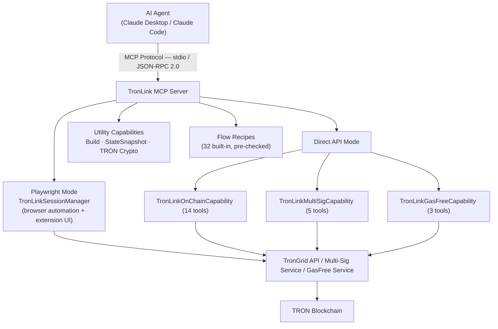

# MCP Server TronLink 

## Overview

**GitHub**: [https://github.com/TronLink/mcp-server-tronlink](https://github.com/TronLink/mcp-server-tronlink)

**mcp-server-tronlink** is a production-ready Model Context Protocol (MCP) server that enables AI agents (Claude, GPT, etc.) to interact with the TRON blockchain through natural language. Built on `@tronlink/tronlink-mcp-core`, it provides **52 tools** across two complementary operation modes.

**Key Highlights:**
- Dual-mode architecture: **Playwright** (browser automation) + **Direct API** (on-chain operations)
- 32 built-in Flow Recipes with pre-checks and dependency resolution
- Non-custodial local transaction signing via encrypted `agent-wallet`
- Multi-signature management with real-time WebSocket monitoring
- Gas-free TRC20 transfers via GasFree service integration

---

## Architecture



Both modes can run simultaneously and tools are auto-enabled based on configuration.

---

## Dual-Mode Operation

### Mode 1: Playwright (Browser Automation)

Controls the TronLink Chrome extension via Playwright Chromium. Ideal for **E2E testing, UI validation, and DApp interaction**.

**Capabilities:**
- Launch browser with `--load-extension` flag for TronLink
- Auto-detect extension ID from Chrome API
- Multi-tab tracking with automatic role classification (extension / notification / dapp / other)
- DOM-based state extraction (TRON address, TRX balance, network detection)
- Screenshot capture with base64 encoding
- Automatic browser dialog handling (alerts, confirms, prompts)

**27 Playwright tools include:** `tl_launch`, `tl_cleanup`, `tl_navigate`, `tl_click`, `tl_type`, `tl_screenshot`, `tl_accessibility_snapshot`, `tl_describe_screen`, etc.

### Mode 2: Direct API (On-Chain)

Operates directly against TronGrid REST API — no browser required. Ideal for **account queries, transfers, swaps, staking, and multi-sig management**.

**25 API tools grouped into:**

| Group | Tools | Description |
|-------|-------|-------------|
| On-Chain | 14 | Transfer, stake, swap, query, multisig setup |
| Multi-Signature | 5 | Permission query, tx submit, WebSocket monitoring |
| GasFree | 3 | Zero-gas TRC20 transfers |
| Wallet Management | 3 | List wallets, auto-create a wallet, switch the active wallet |

---

## Core Components

### 1. TronLinkSessionManager

Full browser lifecycle management:

| Method | Description |
|--------|-------------|
| `launch()` | Initialize browser with TronLink extension |
| `getExtensionState()` | Extract wallet state from UI |
| `navigateToUrl()` | Navigate to a specific URL |
| `navigateToNotification()` | Open TronLink notification popup |
| `screenshot()` | Capture current UI state |
| `getTrackedPages()` | List all open browser tabs |
| `cleanup()` | Graceful shutdown of all resources |

**Screen Detection:** Auto-detects 15 TronLink screens: `home`, `login`, `settings`, `send`, `receive`, `sign`, `broadcast`, `assets`, `address_book`, `node_management`, `dapp_list`, `create_wallet`, `import_wallet`, `notification`, `unknown`.

### 2. TronLinkOnChainCapability (14 Tools)

Direct API wrapper for TronGrid:

**Query Operations:**
- `getAddress()` — Get the TRON address from encrypted local `agent-wallet`
- `getAccount()` — Balance, bandwidth, energy, permissions
- `getTokens()` — TRC10 and TRC20 token balances
- `getTransaction()` — Transaction details by txID
- `getHistory()` — Transaction history with pagination
- `getStakingInfo()` — Staking status (frozen amounts, votes, unfreezing)

**Transaction Operations:**
- `send()` — Transfer TRX, TRC10, or TRC20 tokens
- `stake()` — Freeze/unfreeze TRX for bandwidth or energy (Stake 2.0)
- `resource()` — Delegate/undelegate bandwidth or energy
- `swap()` — Token swap via SunSwap V2
- `swapV3()` — Token swap via SunSwap V3 Smart Router

**Multi-Sig Operations:**
- `setupMultisig()` — Configure multi-sig permissions
- `createMultisigTx()` — Create unsigned multi-sig transaction
- `signMultisigTx()` — Sign multi-sig transaction

### 3. TronLinkMultiSigCapability (5 Tools)

REST + WebSocket API for TRON multi-signature service:

- `queryAuth()` — Query multi-sig permissions (owner/active, thresholds, weights)
- `submitTransaction()` — Submit signed transaction (auto-broadcast when threshold reached)
- `queryTransactionList()` — List transactions with filtering
- `connectWebSocket()` — Real-time transaction monitoring
- `disconnectWebSocket()` — Stop monitoring

**Implementation:** HmacSHA256 signature generation for API auth, UUID-based request signing, supports both Nile testnet and Mainnet credentials.

### 4. TronLinkGasFreeCapability (3 Tools)

Zero-gas TRC20 transfers via GasFree service:

- `getAccount()` — Query eligibility, supported tokens, daily quota
- `getTransactions()` — Query gas-free transaction history
- `send()` — Send TRC20 with zero gas fee

### 5. Wallet Management (3 Tools)

Runtime wallet management via `@bankofai/agent-wallet` (encrypted `local_secure` storage):

- `tl_wallet_list` — List all wallets with IDs, types, active status, and TRON addresses
- `tl_wallet_create` — Auto-generate an encrypted wallet and attach it to the running MCP session
- `tl_wallet_set_active` — Switch the active wallet by ID (hot-swaps into all capabilities)

If no wallet exists at startup, the server prompts two paths: call `tl_wallet_create` to auto-generate one, or create one manually via CLI and set `AGENT_WALLET_PASSWORD`.
The auto-create path generates a random password, saves it to `~/.agent-wallet/runtime_secrets.json`, creates an encrypted `main` wallet, and enables the running session to use it.

### 6. TRON Cryptography Utils

Pure cryptographic functions — no external service calls:

```text
signTransaction()          raw_data_hex → 65-byte signature (via agent-wallet)
base58CheckEncode()        Payload → base58check address
base58CheckDecode()        TRON address → 21-byte payload
addressToHex()             T-address → 0x41... hex
hexToAddress()             0x41... → T-address
```

Uses `@noble/curves` (secp256k1 ECDSA) and `@noble/hashes` (Keccak-256, SHA256). Private keys are never exposed — all signing is done through the encrypted `agent-wallet`.

---

## Flow Recipes (32 Built-In)

Pre-configured multi-step workflows with dependency checks and parameter templates.

### Playwright Flows
| Flow | Description |
|------|-------------|
| `switchNetworkFlow` | Switch to Mainnet/Nile/Shasta |
| `enableTestNetworksFlow` | Enable testnet visibility |
| `transferTrxFlow` | TRX transfer via UI |
| `transferTokenFlow` | Token transfer via UI |

### On-Chain Flows (11)
| Flow | Description |
|------|-------------|
| `chainCheckBalanceFlow` | Query balance |
| `chainTransferTrxFlow` | TRX transfer with pre-checks |
| `chainTransferTrc20Flow` | TRC20 transfer with pre-checks |
| `chainStakeFlow` | Stake TRX |
| `chainUnstakeFlow` | Unstake TRX |
| `chainGetStakingFlow` | Query staking info |
| `chainDelegateResourceFlow` | Delegate bandwidth/energy |
| `chainUndelegateResourceFlow` | Undelegate resources |
| `chainSetupMultisigFlow` | Setup multi-sig permissions |
| `chainCreateMultisigTxFlow` | Create unsigned multi-sig tx |
| `chainSwapV3Flow` | SunSwap V3 token swap |

### Multi-Sig Flows (6)
| Flow | Description |
|------|-------------|
| `multisigQueryAuthFlow` | Query permissions |
| `multisigListTransactionsFlow` | List pending transactions |
| `multisigMonitorFlow` | WebSocket real-time monitoring |
| `multisigStopMonitorFlow` | Stop monitoring |
| `multisigSubmitTxFlow` | Submit signed transaction |
| `multisigCheckFlow` | Full status check |

### GasFree Flows (3)
| Flow | Description |
|------|-------------|
| `gasfreeCheckAccountFlow` | Query eligibility |
| `gasfreeTransactionHistoryFlow` | Query history |
| `gasfreeSendFlow` | Gas-free TRC20 transfer |

---

## Configuration

### Environment Variables

**Playwright Mode:**

| Variable | Description |
|----------|-------------|
| `TRONLINK_EXTENSION_PATH` | TronLink extension build directory |
| `TRONLINK_SOURCE_PATH` | Enable build capability |
| `TL_MODE` | `e2e` (test) or `prod` (production) |
| `TL_HEADLESS` | Browser headless mode |
| `TL_SLOW_MO` | Playwright slow-motion delay (ms) |

**TronGrid API:**

| Variable | Description |
|----------|-------------|
| `TL_TRONGRID_URL` | Full-node API URL |
| `TL_TRONGRID_API_KEY` | API key (required for Mainnet). Free tier ≈ 100k requests/day at ~5 QPS; paid tiers raise QPS, daily quota, and add billing. Quotas and headers change over time — see [TronGrid Pricing](https://www.trongrid.io/pricing) and the dashboard for current values, and inspect `X-Ratelimit-*` response headers in your own runtime. Hitting the limit returns HTTP 429 (mapped to `TL_CHAIN_QUERY_FAILED`, retryable). For long-running agents, set up billing alerts at 50% / 80% / 95% of your plan. |
| `TL_SUNSWAP_ROUTER` | SunSwap V2 router address. **No built-in default** — pin to the current router; the value in the example below is **effective as of 2026-05** (Mainnet). Source: [docs.sun.io](https://docs.sun.io). When SunSwap publishes a new router, set this env var rather than waiting on a docs/code change. |
| `TL_SUNSWAP_V3_ROUTER` | SunSwap V3 smart router address. Same rules as V2. |
| `TL_WTRX_ADDRESS` | WTRX contract address. Mainnet WTRX is `TNUC9Qb1rRpS5CbWLmNMxXBjyFoydXjWFR`. Effective as of 2026-05. |

**Wallet (`agent-wallet`):**

| Variable | Description |
|----------|-------------|
| `AGENT_WALLET_PASSWORD` | Encryption password (optional if using `tl_wallet_create`; required for manual or existing wallets) |
| `AGENT_WALLET_DIR` | Custom wallet storage directory |
| `TL_OWNER_WALLET_ID` | Owner wallet ID for multisig signing |
| `TL_COSIGNER_WALLET_ID` | Co-signer wallet ID for multisig |

**Multi-Signature Service:**

| Variable | Description |
|----------|-------------|
| `TL_MULTISIG_BASE_URL` | API base URL |
| `TL_MULTISIG_SECRET_ID` | Project credential |
| `TL_MULTISIG_SECRET_KEY` | HmacSHA256 signing key |
| `TL_MULTISIG_CHANNEL` | Channel/project name |

**GasFree Service:**

| Variable | Description |
|----------|-------------|
| `TL_GASFREE_BASE_URL` | Service URL |
| `TL_GASFREE_API_KEY` | API key |
| `TL_GASFREE_API_SECRET` | API secret |

### Integration Options

**1. Project-Level MCP Config (`.mcp.json`)**

Auto-detected by Claude Code:
```json
{
  "mcpServers": {
    "tronlink": {
      "command": "node",
      "args": ["dist/index.js"],
      "cwd": ".",
      "env": {
        "TL_TRONGRID_URL": "https://nile.trongrid.io"
      }
    }
  }
}
```

If no wallet exists yet, startup shows two paths:

- Auto-create in the running MCP session: call `tl_wallet_create`
- Manual setup: create the wallet locally with `agent-wallet start local_secure --generate --wallet-id main`, then set `AGENT_WALLET_PASSWORD` and restart

If you choose auto-create, the server generates a random password, saves it to `~/.agent-wallet/runtime_secrets.json`, creates an encrypted `main` wallet, and continues with the current session.

For a ready-to-use Nile setup with the common fields already filled, you can extend the config like this:

```json
{
  "mcpServers": {
    "tronlink": {
      "command": "node",
      "args": ["dist/index.js"],
      "cwd": ".",
      "env": {
        "TRONLINK_EXTENSION_PATH": "/path/to/tronlink-extension/dist",
        "TL_MODE": "prod",
        "TL_HEADLESS": "false",
        "TL_TRONGRID_URL": "https://nile.trongrid.io",
        "AGENT_WALLET_PASSWORD": "your-wallet-password",
        "TL_SUNSWAP_ROUTER": "TKzxdSv2FZKQrEqkKVgp5DcwEXBEKMg2Ax",
        "TL_SUNSWAP_V3_ROUTER": "TB6xBCixqRPUSKiXb45ky1GhChFJ7qrfFj",
        "TL_MULTISIG_BASE_URL": "https://apinile.walletadapter.org",
        "TL_MULTISIG_SECRET_ID": "TEST",
        "TL_MULTISIG_SECRET_KEY": "TESTTESTTEST",
        "TL_MULTISIG_CHANNEL": "test",
        "TL_GASFREE_BASE_URL": "https://open-test.gasfree.io/nile/",
        "TL_GASFREE_API_KEY": "your_gasfree_api_key",
        "TL_GASFREE_API_SECRET": "your_gasfree_api_secret"
      }
    }
  }
}
```

If you only need direct API tools and do not need browser automation, you can keep the same structure and omit the Playwright-related fields:

```json
{
  "mcpServers": {
    "tronlink": {
      "command": "node",
      "args": ["dist/index.js"],
      "cwd": ".",
      "env": {
        "TL_TRONGRID_URL": "https://nile.trongrid.io",
        "AGENT_WALLET_PASSWORD": "your-wallet-password",
        "TL_MULTISIG_BASE_URL": "https://apinile.walletadapter.org",
        "TL_MULTISIG_SECRET_ID": "TEST",
        "TL_MULTISIG_SECRET_KEY": "TESTTESTTEST",
        "TL_MULTISIG_CHANNEL": "test",
        "TL_GASFREE_BASE_URL": "https://open-test.gasfree.io/nile/",
        "TL_GASFREE_API_KEY": "your_gasfree_api_key",
        "TL_GASFREE_API_SECRET": "your_gasfree_api_secret"
      }
    }
  }
}
```

**2. Claude Desktop**

Edit `~/Library/Application Support/Claude/claude_desktop_config.json`:
```json
{
  "mcpServers": {
    "tronlink": {
      "command": "node",
      "args": ["/absolute/path/to/dist/index.js"],
      "env": { ... }
    }
  }
}
```

**3. Claude Code Global Settings**

Edit `~/.claude/settings.json` or `.claude/settings.json`.

**4. Any MCP Client**

Supports stdio transport protocol — compatible with any MCP-compliant client.

---

## Project Structure

```text
mcp-server-tronlink/
├── src/
│   ├── index.ts                    # Server entry, config, capability registration
│   ├── wallet.ts                   # Encrypted wallet loading and password handling
│   ├── wallet-tools.ts             # Wallet list/create/switch tools
│   ├── session-manager.ts          # Browser lifecycle (TronLinkSessionManager)
│   ├── capabilities/
│   │   ├── on-chain.ts             # 14 on-chain operations (TronGrid)
│   │   ├── multisig.ts             # 5 multi-sig operations (REST + WS)
│   │   ├── gasfree.ts              # 3 gas-free transfer operations
│   │   ├── build.ts                # Extension webpack build
│   │   ├── state-snapshot.ts       # UI state extraction
│   │   └── tron-crypto.ts          # Address derivation, signing, Base58
│   └── flows/
│       ├── index.ts                # Flow registry (32 recipes)
│       ├── switch-network.ts       # Network switching flows
│       ├── transfer-trx.ts         # Transfer flows
│       ├── multisig.ts             # 6 multi-sig flows
│       ├── onchain.ts              # 11 on-chain flows
│       └── gasfree.ts              # 3 gas-free flows
├── dist/                           # Compiled output
├── .mcp.json                       # MCP configuration
├── .env.example                    # Environment variable reference
├── package.json
├── tsconfig.json
└── README.md
```

---

## Dependencies

Pinned to the `package.json` of `mcp-server-tronlink@0.1.1`. Re-verify when bumping major versions of the wallet, MCP, or crypto libraries.

| Package | Version | Purpose |
|---------|---------|---------|
| `@noble/curves` | ^2.0.1 | secp256k1 ECDSA signing |
| `@noble/hashes` | ^2.0.1 | Keccak-256, SHA256 |
| `@tronlink/tronlink-mcp-core` | ^0.1.0 | Core MCP server framework |
| `playwright` | ^1.49.0 | Browser automation |
| `@bankofai/agent-wallet` | ^2.3.0 | Encrypted local wallet management (`local_secure`) — pinned, not `latest`, to keep wallet behavior reproducible |
| `ws` | ^8.18.0 | WebSocket (multi-sig monitoring) |

---

## Tool Contract & Side Effects

**Input/output schemas and error contract.** Each tool's input/output schema and the structured error envelope are defined by the underlying framework — see [TronLink MCP Core](tronlink-mcp-core.md#error-codes) for the SSOT error code table (`code` / `retryable` / `hint` / triggered_by). Every response carries `meta.schemaVersion`; field meanings are stable within a major version. Agents should branch on `error.code` and `error.retryable`, never on the human-readable `message`.

**Per-tool input schemas are discoverable at runtime.** Every tool's parameters are Zod-validated in core and exposed as a JSON `inputSchema` via the MCP `list_tools` method, so a client can enumerate names, types, and required fields without reading this page. The tables below summarize tools by capability; `list_tools` is the authoritative, machine-readable source.

**Side-effect classification.** Classify before calling; never auto-retry a write whose outcome is uncertain.

| Side effect | Examples |
| --- | --- |
| **Read-only** (Network Read) | `tl_chain_get_account`, `tl_chain_get_tx`, `tl_gasfree_get_account`, `tl_wallet_list`, screen/state reads |
| **Remote Write** (signs / changes remote state) | `tl_chain_send`, `tl_chain_stake`, `tl_chain_swap_v3`, `tl_multisig_submit_tx`, transfers, delegation |

- **Pre-checks:** all transaction tools validate (balances, reverts, resource burn) before execution.
- **Human-in-the-loop:** write tools sign with the encrypted local `agent-wallet`; in browser-mode flows the user approves in the TronLink UI. Treat every Remote Write tool as requiring confirmation in production.
- **Retry:** read-only tools are safe to retry; Remote Write tools must not be auto-retried unless proven idempotent.

---

## Security Model

| Aspect | Implementation |
|--------|----------------|
| Key storage | Encrypted local wallet managed by `@bankofai/agent-wallet` |
| Key exposure | No key material logged to stderr |
| Signing | Local transaction signing via encrypted `agent-wallet` — plain-text private keys are not supported |
| Pre-checks | All transactions validate before execution |
| Git safety | Config files in `.gitignore` prevent accidental commits |
| Default network | Nile testnet with safe defaults |

### Security Boundaries

| Boundary | Guarantee | Agent / operator obligation |
|---|---|---|
| **Prompt injection** | Tool inputs are consumed verbatim as call arguments. The server never concatenates tool inputs into a prompt re-sent to an LLM. Strings retrieved from chain or third-party APIs (account memos, contract revert reasons, transaction notes) **may contain attacker-controlled text** — treat them as untrusted. | Do not let the agent auto-route Remote Write tools off prose returned from a read. Always require structured fields (`txId`, `code`, `retryable`) for branching. |
| **Outbound host allowlist (SSRF)** | The server only originates HTTPS to the four configured endpoints: `TL_TRONGRID_URL` (TronGrid), `TL_MULTISIG_BASE_URL`, `TL_GASFREE_BASE_URL`, and SunSwap routers via TronWeb. Tools never accept user-supplied URLs that get fetched verbatim. | Pin these env vars to known hosts in production; do not let LLM input populate any `*_BASE_URL`. |
| **API key handling (token passthrough)** | `TL_TRONGRID_API_KEY`, `TL_MULTISIG_SECRET_KEY`, `TL_GASFREE_API_SECRET` are read from env at startup and used only on the outbound leg. They are **not** returned in any tool response, error `details`, or Knowledge Store record. The server does not accept Authorization headers from MCP clients and forward them upstream. | Audit env capture in your MCP host config (some hosts log env); store secrets in the host's secret manager, not in `.mcp.json` committed to git. |
| **Browser JS execution** | `tl_evaluate` runs arbitrary JavaScript in the controlled Playwright browser context. This is a **High-risk / Destructive** primitive — it can read DOM, click invisible elements, exfiltrate state, and bypass UI HITL. | Disable `tl_evaluate` from the MCP host's tool allowlist for any agent that does not strictly require it. Never expose it to a remote/multi-user MCP deployment. |
| **HITL bypass** | Direct-API tools (`tl_chain_send`, `tl_chain_swap_v3`, etc.) sign with the local encrypted `agent-wallet` and broadcast **without** a TronLink browser approval. The `agent-wallet` password is the only barrier. | Hold `AGENT_WALLET_PASSWORD` outside the agent's reach. For production, prefer `mcp-tronlink-signer` (browser approval) over Direct-API for any tool that moves funds. |
| **Confused deputy** | Tools operate under the local `agent-wallet` identity, not the calling user's identity. There is no per-call authorization scope. | One MCP session = one wallet identity; do not multiplex multiple end users through the same server. |
| **Transport** | stdio transport; the server does not bind a network listener. | Do not wrap this server behind a public HTTP transport without re-introducing auth and rate limiting. |

#### Swap safety (`tl_chain_swap` / `tl_chain_swap_v3`)

Swaps are **Remote Write** and execute against a public DEX router, so they are exposed to **price slippage** and **front-running / MEV** (e.g. sandwich attacks): the realized output can be worse than quoted if the pool moves between quote and execution.

- **Always bound the trade with a minimum-output / slippage limit.** Inspect the `tl_chain_swap_v3` input schema via `list_tools` (the `SwapV3Params` shape) for the exact slippage / minimum-output field names — do **not** rely on an unstated default, and treat a missing or zero minimum-output as unsafe.
- **Quote immediately before executing.** Get a fresh quote/route (e.g. Skills `tron-swap` `swap-quote` / `swap-route`), pick a tolerance you accept, and pass it explicitly.
- **Pin the router.** `TL_SUNSWAP_V3_ROUTER` has no built-in default; a stale or wrong router can route funds unexpectedly. Set it to the current SunSwap V3 router (see Environment Variables).
- **No auto-retry.** A failed/uncertain swap is a Remote Write — confirm on-chain before re-issuing (`TL_CHAIN_SWAP_FAILED` is not retryable).

#### Multi-sig credential hygiene (`TL_MULTISIG_SECRET_ID` / `TL_MULTISIG_SECRET_KEY`)

These are HMAC-SHA256 API credentials for the multi-sig service (not on-chain keys), but they authorize transaction submission — treat them as secrets.

- **Per-environment isolation.** Use distinct credentials for Mainnet vs testnet and per project/channel (`TL_MULTISIG_CHANNEL`). Never reuse a Mainnet secret in a test/staging MCP host.
- **Storage.** Keep them in the host's secret manager / env, never in a `.mcp.json` committed to git (see the token-passthrough boundary above).
- **Rotation.** Rotate `TL_MULTISIG_SECRET_KEY` periodically, and immediately if a host or log may have captured it. The server reads credentials from env at startup, so rotation on this side is an **env update + server restart**; issue/revoke the credential itself through the multi-sig service console.
- **Revocation.** If a secret is suspected leaked, revoke it at the service and rotate before the next signing session — an exposed secret lets an attacker submit transactions to the multi-sig queue.
- **Least privilege.** Scope each credential to the channel/project it needs; do not share one secret across unrelated agents.

#### Disabling `tl_evaluate`

If your workflow does not require running arbitrary JS in the controlled browser, take it off the tool surface explicitly. The exact key depends on the host:

```jsonc
// Claude Code — .claude/settings.json (project) or ~/.claude/settings.json (user)
{
  "permissions": {
    "deny": ["mcp__tronlink__tl_evaluate"]
  }
}
```

```jsonc
// Claude Desktop — claude_desktop_config.json
{
  "mcpServers": {
    "tronlink": {
      "command": "node",
      "args": ["dist/index.js"],
      "disabledTools": ["tl_evaluate"]
    }
  }
}
```

```jsonc
// Generic MCP client: prefer client-side filtering via list_tools.
// Filter the server's announced tools before exposing them to the model;
// drop any tool whose name is "tl_evaluate".
```

Verify after restart with `list_tools` — `tl_evaluate` should not appear. The same pattern works for `tl_seed_contract` / `tl_seed_contracts` (e2e-only contract deployment).

### Wallet Secret Storage

The Direct-API path signs with a local encrypted wallet managed by `@bankofai/agent-wallet`. Two paths exist for unlocking it; pick deliberately.

**Path A — Manual (recommended for production).** Create the wallet out-of-band, set `AGENT_WALLET_PASSWORD` via the MCP host's secret manager, and start the server. The password lives only in process memory; nothing is written by this server.

**Path B — Auto-create (convenience for local dev).** If no wallet exists at startup and the agent calls `tl_wallet_create`, the server:

1. Generates a random password.
2. Writes it in plaintext to `~/.agent-wallet/runtime_secrets.json` so a restart can reuse the wallet.
3. Creates an encrypted `main` wallet at `~/.agent-wallet/` (override with `AGENT_WALLET_DIR`).

| Aspect | Behavior |
|---|---|
| **File** | `~/.agent-wallet/runtime_secrets.json` (plaintext JSON containing the password) |
| **Recommended permissions** | `chmod 600` — the file is created under the user's `$HOME`, but no umask hardening is enforced. Verify after first run. |
| **Git safety** | `~/.agent-wallet/` is outside any repo by default. If you point `AGENT_WALLET_DIR` inside a repo, add it to `.gitignore` explicitly. |
| **Knowledge Store redaction** | The Knowledge Store auto-redacts `password`, `mnemonic`, `private_key`, `seed` fields in tool inputs / outputs. It does **not** read or sanitize `runtime_secrets.json`. The file is independent of the Knowledge Store. |
| **Logs / stderr** | The auto-generated password is not logged. The file path may appear in startup output. |
| **Backups** | Backing up `~/.agent-wallet/` without also protecting `runtime_secrets.json` defeats encryption-at-rest. Either back up both encrypted, or back up the encrypted wallet and re-set the password by hand on restore. |

**Production guidance.**

- Prefer Path A. Source `AGENT_WALLET_PASSWORD` from the host's secret manager (Claude Desktop env, vault, etc.).
- If you must use Path B (e.g., ephemeral CI), set `AGENT_WALLET_DIR` to a tmpfs path that is destroyed at job end.
- For any tool that moves real funds, prefer `mcp-tronlink-signer` (browser approval, no on-disk password) over Direct-API.

**How to enforce Path A (doc-side, today).**

1. Provision the wallet **before** the server boots. From a separate shell:

    ```bash
    agent-wallet start local_secure --generate --wallet-id main
    # take note of the password you supply here — it is the only copy
    ```

2. Inject the password via the MCP host's secret manager so it lands in the server's `env` at launch:

    ```jsonc
    // .mcp.json — secret comes from host env, not from this file
    {
      "mcpServers": {
        "tronlink": {
          "command": "node",
          "args": ["dist/index.js"],
          "env": { "AGENT_WALLET_PASSWORD": "${AGENT_WALLET_PASSWORD}" }
        }
      }
    }
    ```

3. **Do not let the agent call `tl_wallet_create`.** Disable it the same way as `tl_evaluate` above (Claude Code `permissions.deny`, Claude Desktop `disabledTools`, or client-side `list_tools` filtering on the name `tl_wallet_create`).

4. Verify on first launch: `list_tools` should not include `tl_wallet_create`, and the absence of `~/.agent-wallet/runtime_secrets.json` confirms Path B did not run.

**Tracking issue (code-side).** A `--no-auto-create` / `AGENT_WALLET_DISABLE_AUTOCREATE=1` flag that makes the server fail-loud at startup when no wallet exists is the proper long-term fix; until that ships upstream, the doc-side enforcement above is the defense in depth.

---

## Typical Usage Scenarios

1. **Wallet Operations** — List wallets, auto-create or switch the active wallet, check balance, send transfers
2. **DApp Testing** — Launch browser, connect wallet, sign transactions, verify state
3. **On-Chain Trading** — Direct API swaps, staking, token transfers without browser
4. **Multi-Sig Workflows** — Set up permissions, submit/monitor transactions
5. **Gas-Free Operations** — TRC20 transfers without TRX balance requirements
6. **Infrastructure Testing** — Contract deployment, fixture management, mock servers

---

## Quick Start

```bash
# 1. Build
npm install && npm run build

# 2. Configure .mcp.json (Nile testnet example)
# Add:
#   TL_TRONGRID_URL=https://nile.trongrid.io
#
# 3. If no wallet exists, choose one path:
#   Option A: call tl_wallet_create after startup
#   Option B: create one locally, then set AGENT_WALLET_PASSWORD

# 4. Use with Claude Code
# "Check my TRX balance"
# "Send 10 TRX to TAddress..."
# "Swap 100 TRX for USDT on SunSwap V3"
```

## Version & License

- **Package:** `@tronlink/mcp-server-tronlink` v0.1.1
- **License:** MIT — `SPDX-License-Identifier: MIT`
- **Changelog / releases:** [https://github.com/TronLink/mcp-server-tronlink/releases](https://github.com/TronLink/mcp-server-tronlink/releases)
