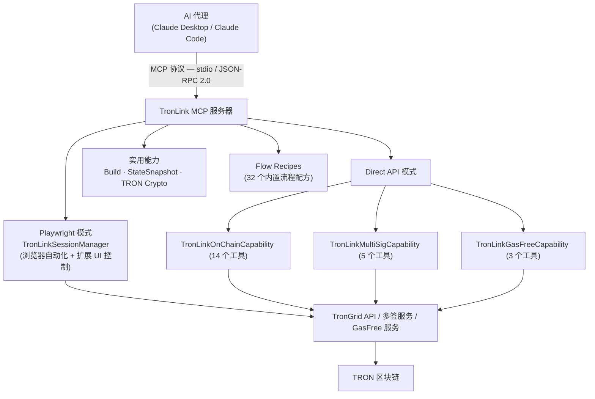

# MCP Server TronLink 

## 概述

**GitHub**: [https://github.com/TronLink/mcp-server-tronlink](https://github.com/TronLink/mcp-server-tronlink)

**mcp-server-tronlink** 是一个生产级的 Model Context Protocol (MCP) 服务器，使 AI 代理（Claude、GPT 等）能够通过自然语言与 TRON 区块链交互。基于 `@tronlink/tronlink-mcp-core` 构建，提供跨两种互补操作模式的 **52 工具**。

**核心亮点：**
- 双模架构：**Playwright**（浏览器自动化）+ **Direct API**（链上操作）
- 32 个内置 Flow Recipe，带预检查和依赖解析
- 基于加密 `agent-wallet` 的非托管本地交易签名
- 多签管理，支持实时 WebSocket 监控
- 通过 GasFree 服务集成实现零 Gas TRC20 转账

---

## 架构设计



两种模式可同时运行，工具根据配置自动启用。

---

## 双模运行机制

### 模式一：Playwright（浏览器自动化）

通过 Playwright Chromium 控制 TronLink Chrome 扩展。适用于 **E2E 测试、UI 验证和 DApp 交互**。

**能力：**
- 使用 `--load-extension` 标志启动浏览器加载 TronLink
- 从 Chrome API 自动检测扩展 ID
- 多标签页跟踪，自动角色分类（扩展 / 通知 / DApp / 其他）
- 基于 DOM 的状态提取（TRON 地址、TRX 余额、网络检测）
- Base64 编码的截图捕获
- 自动处理浏览器对话框（alert、confirm、prompt）

**27 个 Playwright 工具包括：** `tl_launch`、`tl_cleanup`、`tl_navigate`、`tl_click`、`tl_type`、`tl_screenshot`、`tl_accessibility_snapshot`、`tl_describe_screen` 等。

### 模式二：Direct API（链上操作）

直接调用 TronGrid REST API——无需浏览器。适用于 **账户查询、转账、兑换、质押和多签管理**。

**25 个 API 工具分组：**

| 分组 | 工具数 | 说明 |
|------|--------|------|
| 钱包管理 | 3 | 列出钱包、自动创建、切换当前钱包 |
| 链上操作 | 14 | 转账、质押、兑换、查询、多签设置 |
| 多签管理 | 5 | 权限查询、交易提交、WebSocket 监控 |
| GasFree | 3 | 零 Gas TRC20 转账 |

---

## 核心组件

### 1. TronLinkSessionManager

完整的浏览器生命周期管理：

| 方法 | 说明 |
|------|------|
| `launch()` | 使用 TronLink 扩展初始化浏览器 |
| `getExtensionState()` | 从 UI 提取钱包状态 |
| `navigateToUrl()` | 导航到指定 URL |
| `navigateToNotification()` | 打开 TronLink 通知弹窗 |
| `screenshot()` | 捕获当前 UI 状态 |
| `getTrackedPages()` | 列出所有打开的浏览器标签页 |
| `cleanup()` | 优雅地关闭所有资源 |

**页面检测：** 自动检测 15 种 TronLink 界面：`home`、`login`、`settings`、`send`、`receive`、`sign`、`broadcast`、`assets`、`address_book`、`node_management`、`dapp_list`、`create_wallet`、`import_wallet`、`notification`、`unknown`。

### 2. TronLinkOnChainCapability（14 个工具）

TronGrid 的直接 API 封装：

**查询操作：**
- `getAddress()` — 从本地加密的 `agent-wallet` 读取 TRON 地址
- `getAccount()` — 余额、带宽、能量、权限
- `getTokens()` — TRC10 和 TRC20 代币余额
- `getTransaction()` — 按 txID 获取交易详情
- `getHistory()` — 分页查询交易历史
- `getStakingInfo()` — 质押状态（冻结金额、投票、解冻）

**交易操作：**
- `send()` — 转账 TRX、TRC10 或 TRC20 代币
- `stake()` — 冻结/解冻 TRX 获取带宽或能量（Stake 2.0）
- `resource()` — 代理/取消代理带宽或能量
- `swap()` — 通过 SunSwap V2 代币兑换
- `swapV3()` — 通过 SunSwap V3 智能路由代币兑换

**多签操作：**
- `setupMultisig()` — 配置多签权限
- `createMultisigTx()` — 创建未签名的多签交易
- `signMultisigTx()` — 签署多签交易

### 3. TronLinkMultiSigCapability（5 个工具）

TRON 多签服务的 REST + WebSocket API：

- `queryAuth()` — 查询多签权限（所有者/活跃权限、阈值、权重）
- `submitTransaction()` — 提交签名交易（达到阈值时自动广播）
- `queryTransactionList()` — 带过滤条件的交易列表
- `connectWebSocket()` — 实时交易监控
- `disconnectWebSocket()` — 停止监控

**实现细节：** HmacSHA256 签名生成用于 API 认证，基于 UUID 的请求签名，同时支持 Nile 测试网和主网凭证。

### 4. TronLinkGasFreeCapability（3 个工具）

通过 GasFree 服务实现零 Gas TRC20 转账：

- `getAccount()` — 查询资格、支持的代币、每日配额
- `getTransactions()` — 查询免 Gas 交易历史
- `send()` — 零 Gas 费发送 TRC20

### 5. 钱包管理（3 个工具）

通过 `@bankofai/agent-wallet` 进行运行时钱包管理（加密 `local_secure` 存储）：

- `tl_wallet_list` — 列出所有钱包及其 ID、类型、活跃状态和 TRON 地址
- `tl_wallet_create` — 自动生成加密钱包并绑定到当前 MCP 会话
- `tl_wallet_set_active` — 按 ID 切换活跃钱包（热切换到所有能力）

如果启动时没有钱包，服务器会提示两条路径：调用 `tl_wallet_create` 自动生成，或通过 CLI 手动创建后设置 `AGENT_WALLET_PASSWORD`。
自动创建这条路径会生成随机密码，把密码保存到 `~/.agent-wallet/runtime_secrets.json`，创建一个加密的 `main` 钱包，并让当前会话立即可用。

### 6. TRON 密码学工具

纯密码学函数——无外部服务调用：

```text
signTransaction()          raw_data_hex → 65 字节签名（通过 agent-wallet）
base58CheckEncode()        有效载荷 → base58check 编码地址
base58CheckDecode()        TRON 地址 → 21 字节有效载荷
addressToHex()             T 地址 → 0x41... 十六进制
hexToAddress()             0x41... → T 地址
```

使用 `@noble/curves`（secp256k1 ECDSA）和 `@noble/hashes`（Keccak-256、SHA256）。私钥不会暴露——所有签名均通过加密的 `agent-wallet` 完成。

---

## Flow Recipes（32 个内置流程）

预配置的多步骤工作流，带依赖检查和参数模板。

### Playwright 流程
| 流程 | 说明 |
|------|------|
| `switchNetworkFlow` | 切换到主网/Nile/Shasta |
| `enableTestNetworksFlow` | 启用测试网可见性 |
| `transferTrxFlow` | 通过 UI 进行 TRX 转账 |
| `transferTokenFlow` | 通过 UI 进行代币转账 |

### 链上流程（11 个）
| 流程 | 说明 |
|------|------|
| `chainCheckBalanceFlow` | 查询余额 |
| `chainTransferTrxFlow` | 带预检查的 TRX 转账 |
| `chainTransferTrc20Flow` | 带预检查的 TRC20 转账 |
| `chainStakeFlow` | 质押 TRX |
| `chainUnstakeFlow` | 解除质押 TRX |
| `chainGetStakingFlow` | 查询质押信息 |
| `chainDelegateResourceFlow` | 代理带宽/能量 |
| `chainUndelegateResourceFlow` | 取消代理资源 |
| `chainSetupMultisigFlow` | 设置多签权限 |
| `chainCreateMultisigTxFlow` | 创建未签名的多签交易 |
| `chainSwapV3Flow` | SunSwap V3 代币兑换 |

### 多签流程（6 个）
| 流程 | 说明 |
|------|------|
| `multisigQueryAuthFlow` | 查询权限 |
| `multisigListTransactionsFlow` | 列出待处理交易 |
| `multisigMonitorFlow` | WebSocket 实时监控 |
| `multisigStopMonitorFlow` | 停止监控 |
| `multisigSubmitTxFlow` | 提交签名交易 |
| `multisigCheckFlow` | 完整状态检查 |

### GasFree 流程（3 个）
| 流程 | 说明 |
|------|------|
| `gasfreeCheckAccountFlow` | 查询资格 |
| `gasfreeTransactionHistoryFlow` | 查询历史 |
| `gasfreeSendFlow` | 免 Gas TRC20 转账 |

---

## 配置说明

### 环境变量

**Playwright 模式：**

| 变量 | 说明 |
|------|------|
| `TRONLINK_EXTENSION_PATH` | TronLink 扩展构建目录 |
| `TRONLINK_SOURCE_PATH` | 启用构建能力 |
| `TL_MODE` | `e2e`（测试）或 `prod`（生产） |
| `TL_HEADLESS` | 浏览器无头模式 |
| `TL_SLOW_MO` | Playwright 慢动作延迟（毫秒） |

**TronGrid API：**

| 变量 | 说明 |
|------|------|
| `TL_TRONGRID_URL` | 全节点 API 地址 |
| `TL_TRONGRID_API_KEY` | API 密钥（主网必需）。免费档约 100k 请求/日 + ~5 QPS；付费档提高 QPS、日配额并按用量计费。具体配额与响应 header 会变——请查 [TronGrid Pricing](https://www.trongrid.io/pricing) 与控制台当前值，并在运行时读 `X-Ratelimit-*` header。触发限流返回 HTTP 429（映射到 `TL_CHAIN_QUERY_FAILED`，可重试）。长期跑批的 agent 请在 50% / 80% / 95% 设置消费告警。 |
| `TL_SUNSWAP_ROUTER` | SunSwap V2 路由地址。**没有内置默认**——请钉到当前 router；下方示例中的值**截至 2026-05** 适用于主网。来源：[docs.sun.io](https://docs.sun.io)。SunSwap 升级新 router 时，请直接在此 env 改值，不要等文档/代码同步。 |
| `TL_SUNSWAP_V3_ROUTER` | SunSwap V3 智能路由地址。规则同 V2。 |
| `TL_WTRX_ADDRESS` | WTRX 合约地址。主网 WTRX 为 `TNUC9Qb1rRpS5CbWLmNMxXBjyFoydXjWFR`。数据截至 2026-05。 |

**钱包（agent-wallet）：**

| 变量 | 说明 |
|------|------|
| `AGENT_WALLET_PASSWORD` | 钱包加密密码（自动创建时可省略；手动或已有钱包时需要） |
| `AGENT_WALLET_DIR` | 自定义钱包目录 |
| `TL_OWNER_WALLET_ID` | 多签 owner 使用的钱包 ID |
| `TL_COSIGNER_WALLET_ID` | 多签 cosigner 使用的钱包 ID |

**多签服务：**

| 变量 | 说明 |
|------|------|
| `TL_MULTISIG_BASE_URL` | API 基础地址 |
| `TL_MULTISIG_SECRET_ID` | 项目凭证 |
| `TL_MULTISIG_SECRET_KEY` | HmacSHA256 签名密钥 |
| `TL_MULTISIG_CHANNEL` | 渠道/项目名称 |

**GasFree 服务：**

| 变量 | 说明 |
|------|------|
| `TL_GASFREE_BASE_URL` | 服务地址 |
| `TL_GASFREE_API_KEY` | API 密钥 |
| `TL_GASFREE_API_SECRET` | API Secret |

### 集成方式

**1. 项目级 MCP 配置（`.mcp.json`）**

Claude Code 自动检测：
```json
{
  "mcpServers": {
    "tronlink": {
      "command": "node",
      "args": ["dist/index.js"],
      "cwd": ".",
      "env": {
        "TL_TRONGRID_URL": "https://nile.trongrid.io"
      }
    }
  }
}
```

如果本地还没有钱包，服务启动后会提示两条路径：

1. 自动创建：调用 `tl_wallet_create`
2. 手动创建：
   1. 运行 `agent-wallet start local_secure --generate --wallet-id main`
   2. 把 `AGENT_WALLET_PASSWORD` 写进 `.mcp.json`
   3. 重启 MCP 服务

如果选择自动创建，服务会生成随机密码，把密码保存到 `~/.agent-wallet/runtime_secrets.json`，创建一个加密的 `main` 钱包，并继续当前会话。

如果你想直接照着一个更完整的 Nile 示例来配，可以在这个最小示例的基础上补成下面这样：

```json
{
  "mcpServers": {
    "tronlink": {
      "command": "node",
      "args": ["dist/index.js"],
      "cwd": ".",
      "env": {
        "TRONLINK_EXTENSION_PATH": "/path/to/tronlink-extension/dist",
        "TL_MODE": "prod",
        "TL_HEADLESS": "false",
        "TL_TRONGRID_URL": "https://nile.trongrid.io",
        "AGENT_WALLET_PASSWORD": "your-wallet-password",
        "TL_SUNSWAP_ROUTER": "TKzxdSv2FZKQrEqkKVgp5DcwEXBEKMg2Ax",
        "TL_SUNSWAP_V3_ROUTER": "TB6xBCixqRPUSKiXb45ky1GhChFJ7qrfFj",
        "TL_MULTISIG_BASE_URL": "https://apinile.walletadapter.org",
        "TL_MULTISIG_SECRET_ID": "TEST",
        "TL_MULTISIG_SECRET_KEY": "TESTTESTTEST",
        "TL_MULTISIG_CHANNEL": "test",
        "TL_GASFREE_BASE_URL": "https://open-test.gasfree.io/nile/",
        "TL_GASFREE_API_KEY": "your_gasfree_api_key",
        "TL_GASFREE_API_SECRET": "your_gasfree_api_secret"
      }
    }
  }
}
```

如果你只需要直接 API 工具，不需要浏览器自动化，也可以保留同样的结构，只去掉 Playwright 相关字段：

```json
{
  "mcpServers": {
    "tronlink": {
      "command": "node",
      "args": ["dist/index.js"],
      "cwd": ".",
      "env": {
        "TL_TRONGRID_URL": "https://nile.trongrid.io",
        "AGENT_WALLET_PASSWORD": "your-wallet-password",
        "TL_MULTISIG_BASE_URL": "https://apinile.walletadapter.org",
        "TL_MULTISIG_SECRET_ID": "TEST",
        "TL_MULTISIG_SECRET_KEY": "TESTTESTTEST",
        "TL_MULTISIG_CHANNEL": "test",
        "TL_GASFREE_BASE_URL": "https://open-test.gasfree.io/nile/",
        "TL_GASFREE_API_KEY": "your_gasfree_api_key",
        "TL_GASFREE_API_SECRET": "your_gasfree_api_secret"
      }
    }
  }
}
```

**2. Claude Desktop**

编辑 `~/Library/Application Support/Claude/claude_desktop_config.json`。

**3. Claude Code 全局设置**

编辑 `~/.claude/settings.json` 或 `.claude/settings.json`。

**4. 任意 MCP 客户端**

支持 stdio 传输协议——兼容任何符合 MCP 标准的客户端。

---

## 项目结构

```text
mcp-server-tronlink/
├── src/
│   ├── index.ts                    # 服务入口、配置、能力注册
│   ├── wallet.ts                   # 统一钱包入口（agent-wallet、加密钱包、引导创建）
│   ├── wallet-tools.ts             # 钱包管理工具（list / create / set_active）
│   ├── session-manager.ts          # 浏览器生命周期（TronLinkSessionManager）
│   ├── capabilities/
│   │   ├── on-chain.ts             # 14 个链上操作（TronGrid）
│   │   ├── multisig.ts             # 5 个多签操作（REST + WS）
│   │   ├── gasfree.ts              # 3 个免 Gas 转账操作
│   │   ├── build.ts                # 扩展 webpack 构建
│   │   ├── state-snapshot.ts       # UI 状态提取
│   │   └── tron-crypto.ts          # 地址派生、签名、Base58
│   └── flows/
│       ├── index.ts                # 流程注册（32 个配方）
│       ├── switch-network.ts       # 网络切换流程
│       ├── transfer-trx.ts         # 转账流程
│       ├── multisig.ts             # 6 个多签流程
│       ├── onchain.ts              # 11 个链上流程
│       └── gasfree.ts              # 3 个免 Gas 流程
├── dist/                           # 编译输出
├── .mcp.json                       # MCP 配置
├── .env.example                    # 环境变量参考
├── package.json
├── tsconfig.json
└── README.md
```

---

## 依赖项

锁定到 `mcp-server-tronlink@0.1.1` 的 `package.json`。升级钱包、MCP 或密码学库 major 版本时务必重新核对。

| 包名 | 版本 | 用途 |
|------|------|------|
| `@noble/curves` | ^2.0.1 | secp256k1 ECDSA 签名 |
| `@noble/hashes` | ^2.0.1 | Keccak-256、SHA256 |
| `@tronlink/tronlink-mcp-core` | ^0.1.0 | 核心 MCP 服务框架 |
| `playwright` | ^1.49.0 | 浏览器自动化 |
| `@bankofai/agent-wallet` | ^2.3.0 | 加密本地钱包管理（`local_secure`）——**已钉版本，不用 `latest`**，确保钱包行为可复现 |
| `ws` | ^8.18.0 | WebSocket（多签监控） |

---

## 工具契约与副作用

**输入/输出 schema 与错误契约。** 每个工具的输入/输出 schema 及结构化错误信封由底层框架定义——见 [TronLink MCP Core](tronlink-mcp-core.md#错误码) 的 SSOT 错误码表（`code` / `retryable` / `hint` / 典型触发）。每个响应均带 `meta.schemaVersion`，major 版本内字段含义稳定。Agent 应基于 `error.code` 与 `error.retryable` 分支，**不要**解析人类可读的 `message`。

**逐工具输入 schema 可在运行时发现。** 每个工具的参数都由 core 用 Zod 校验,并通过 MCP `list_tools` 方法以 JSON `inputSchema` 形式暴露,因此客户端无需阅读本页即可枚举参数名、类型和必填项。下方表格按能力归纳工具;`list_tools` 才是权威的机器可读来源。

**副作用分级。** 调用前先分类；对结果未知的写操作绝不自动重试。

| 副作用 | 示例 |
| --- | --- |
| **只读**（Network Read） | `tl_chain_get_account`、`tl_chain_get_tx`、`tl_gasfree_get_account`、`tl_wallet_list`、屏幕/状态读取 |
| **远程写**（签名 / 改变远程状态） | `tl_chain_send`、`tl_chain_stake`、`tl_chain_swap_v3`、`tl_multisig_submit_tx`、转账、资源代理 |

- **预检查：** 所有交易类工具在执行前会校验（余额、回滚、资源消耗）。
- **人工确认（HITL）：** 写操作工具使用加密的本地 `agent-wallet` 签名；浏览器模式下由用户在 TronLink UI 审批。生产环境应将每个「远程写」工具视为需要确认。
- **重试：** 只读工具可安全重试；「远程写」工具除非证明幂等，否则不得自动重试。

---

## 安全模型

| 方面 | 实现方式 |
|------|----------|
| 密钥存储 | 由 `@bankofai/agent-wallet` 负责本地加密存储（`local_secure`） |
| 密钥暴露 | 不向 stderr 记录任何密钥信息 |
| 签名方式 | 通过加密的 `agent-wallet` 本地交易签名——不支持明文私钥 |
| 预检查 | 所有交易在执行前验证 |
| Git 安全 | 配置文件在 `.gitignore` 中防止意外提交 |
| 默认网络 | Nile 测试网，安全默认值 |

### 安全边界

| 边界 | 保证 | Agent / 运维方义务 |
|---|---|---|
| **Prompt 注入** | 工具输入按原始值作为调用参数使用，server 不会把工具输入拼接进任何向 LLM 二次提交的 prompt。**但**从链上或第三方 API 拿回来的字符串（账户备注、合约 revert 原因、交易 note 等）**可能含攻击者控制内容**，必须视为不可信。 | 不要让 agent 基于 read 工具返回的 prose 自动路由到 Remote Write。分支必须基于结构化字段（`txId`、`code`、`retryable`）。 |
| **出站 host 白名单（SSRF）** | server 只向 4 个配置端点发起 HTTPS：`TL_TRONGRID_URL`、`TL_MULTISIG_BASE_URL`、`TL_GASFREE_BASE_URL`，以及通过 TronWeb 访问的 SunSwap router。工具不接收会被原样请求的用户 URL。 | 生产环境把这些 env 钉死到已知 host；禁止 LLM 输入回填任何 `*_BASE_URL`。 |
| **API key 处理（token passthrough）** | `TL_TRONGRID_API_KEY`、`TL_MULTISIG_SECRET_KEY`、`TL_GASFREE_API_SECRET` 仅在启动时从 env 读取，仅用于出站；**不**会出现在任何工具响应、错误 `details` 或 Knowledge Store 记录中。server 不接受 MCP 客户端传入的 Authorization header 并转发到上游。 | 审计 MCP host 配置对 env 的捕获（部分 host 会落日志）；secret 放进 host 的 secret manager，不要写进会提交 git 的 `.mcp.json`。 |
| **浏览器 JS 执行** | `tl_evaluate` 会在受控 Playwright 浏览器上下文中执行任意 JS。这是 **High-risk / Destructive** 原语——可读 DOM、点击隐藏元素、外泄状态、绕过 UI 上的 HITL。 | 严格不需要时，从 MCP host 的工具白名单中禁用 `tl_evaluate`。绝不要把它暴露给远程/多用户 MCP 部署。 |
| **HITL 绕过** | Direct-API 工具（`tl_chain_send`、`tl_chain_swap_v3` 等）使用本地加密 `agent-wallet` 签名并直接广播，**不**经过 TronLink 浏览器审批。`agent-wallet` 密码是唯一屏障。 | 把 `AGENT_WALLET_PASSWORD` 保管在 agent 不可达处。生产环境涉及资金转移的工具，优先用 `mcp-tronlink-signer`（浏览器审批），而非 Direct-API。 |
| **Confused deputy** | 工具以本地 `agent-wallet` 身份执行，不是调用用户的身份；无逐次调用授权 scope。 | 一个 MCP session = 一个钱包身份，不要把多个终端用户复用到同一 server。 |
| **传输** | 仅 stdio，server 不监听网络端口。 | 包成对外 HTTP 之前必须重新引入认证与限流。 |

#### 兑换安全（`tl_chain_swap` / `tl_chain_swap_v3`）

兑换属于 **远程写**，且对接公开 DEX 路由器，因此暴露在 **价格滑点** 与 **三明治攻击 / MEV** 之下：在报价和执行之间池子价格变动时，实际成交可能比报价更差。

- **必须设置 minOut / 滑点上限。** 通过 `list_tools` 查看 `tl_chain_swap_v3` 的输入 schema（`SwapV3Params`），核对实际的 minimum-output / 滑点字段名；**不要**依赖未声明的默认值，缺省或 0 的 minOut 一律视为不安全。
- **执行前现取报价。** 通过 Skills `tron-swap` 的 `swap-quote` / `swap-route`（或同等接口）取最新报价/路径，选定可接受的滑点容忍度并显式传入。
- **钉死 router。** `TL_SUNSWAP_V3_ROUTER` 没有内置默认值；过期或错误的 router 会把资金路由到非预期目标。请按当前 SunSwap V3 router 地址设置（见环境变量）。
- **不可自动重试。** swap 失败或结果未知都属于远程写——先在链上确认再决定是否重发（`TL_CHAIN_SWAP_FAILED` 不可重试）。

#### 多签凭证管理（`TL_MULTISIG_SECRET_ID` / `TL_MULTISIG_SECRET_KEY`）

这是多签服务的 HMAC-SHA256 API 凭证（不是链上私钥），但它们授权交易提交——必须按 secret 对待。

- **按环境隔离。** Mainnet 与测试网必须使用不同凭证，按项目 / 渠道（`TL_MULTISIG_CHANNEL`）分别申请。**绝不**在测试或预发 MCP host 中复用 Mainnet 凭证。
- **存储。** 放进 host 的 secret manager / env，不要写进会提交 git 的 `.mcp.json`（参见上面的 token passthrough 边界）。
- **轮换。** 周期性轮换 `TL_MULTISIG_SECRET_KEY`；如果 host 或日志可能记录过，立刻轮换。server 在启动时读取凭证，所以本侧轮换 = **更新 env + 重启 server**；凭证本身的颁发 / 撤销在多签服务控制台完成。
- **撤销。** 一旦怀疑泄漏，先在服务侧吊销该凭证，再轮换到新值后再开始下一次签名会话——曝光的凭证可让攻击者直接向多签队列提交交易。
- **最小权限。** 每条凭证只授予所需的 channel / project；不要在多个无关 agent 间共享同一凭证。

#### 禁用 `tl_evaluate`

如果你的工作流不需要在受控浏览器里执行任意 JS，请显式从工具面上撤下。各 host 的配置 key 不同：

```jsonc
// Claude Code —— .claude/settings.json（项目级）或 ~/.claude/settings.json（用户级）
{
  "permissions": {
    "deny": ["mcp__tronlink__tl_evaluate"]
  }
}
```

```jsonc
// Claude Desktop —— claude_desktop_config.json
{
  "mcpServers": {
    "tronlink": {
      "command": "node",
      "args": ["dist/index.js"],
      "disabledTools": ["tl_evaluate"]
    }
  }
}
```

```jsonc
// 通用 MCP 客户端：在客户端侧用 list_tools 过滤——
// 把 server 暴露的工具列表里 name 等于 "tl_evaluate" 的项剔除，再交给模型。
```

重启后用 `list_tools` 验证：`tl_evaluate` 应当不再出现。同一套模式也适用于 `tl_seed_contract` / `tl_seed_contracts`（仅 e2e 的合约部署工具）。

### 钱包密钥存储

Direct-API 路径使用 `@bankofai/agent-wallet` 管理的本地加密钱包签名。解锁这把钱包有两条路径，请按目的明确选择。

**路径 A — 手动（生产推荐）。** 离线创建钱包，将 `AGENT_WALLET_PASSWORD` 放进 MCP host 的 secret manager，再启动 server。密码仅存在于进程内存，server 不写任何文件。

**路径 B — 自动创建（仅适合本地开发）。** 启动时若无钱包且 agent 调用了 `tl_wallet_create`，server 将：

1. 生成随机密码。
2. **将密码以明文写入 `~/.agent-wallet/runtime_secrets.json`**，以便重启后能复用同一钱包。
3. 在 `~/.agent-wallet/` 创建加密的 `main` 钱包（可用 `AGENT_WALLET_DIR` 覆盖目录）。

| 方面 | 行为 |
|---|---|
| **文件** | `~/.agent-wallet/runtime_secrets.json`（含密码的明文 JSON） |
| **建议权限** | `chmod 600`——文件在用户 `$HOME` 下创建，但**没有 umask 兜底**，首次运行后请手工核查。 |
| **Git 隔离** | `~/.agent-wallet/` 默认在任何仓库之外。若把 `AGENT_WALLET_DIR` 指到仓库内部，必须显式加 `.gitignore`。 |
| **Knowledge Store 脱敏边界** | Knowledge Store 自动脱敏 `password`、`mnemonic`、`private_key`、`seed` 等字段；**不**读取或处理 `runtime_secrets.json`。该文件与 Knowledge Store 互相独立。 |
| **日志 / stderr** | 自动生成的密码不会落日志；文件路径可能出现在启动输出中。 |
| **备份** | 仅备份 `~/.agent-wallet/` 而不保护 `runtime_secrets.json`，等于让"加密落盘"形同虚设。两者必须一并加密备份，或仅备份加密钱包并在恢复时手工重置密码。 |

**生产建议。**

- 优先路径 A。`AGENT_WALLET_PASSWORD` 来自 host 的 secret manager（Claude Desktop env、vault 等）。
- 必须用路径 B 时（如临时 CI），把 `AGENT_WALLET_DIR` 指到任务结束即销毁的 tmpfs。
- 涉及真实资金的工具，生产环境优先选 `mcp-tronlink-signer`（浏览器审批、不落盘密码），避免 Direct-API。

**如何强制路径 A（文档侧的当下做法）。**

1. **server 启动前**离线创建钱包：

    ```bash
    agent-wallet start local_secure --generate --wallet-id main
    # 此处输入的密码请单独保管——它是唯一的副本
    ```

2. 让密码通过 MCP host 的 secret manager 注入到 server 的 `env`：

    ```jsonc
    // .mcp.json — secret 来自 host env，而不是这个文件本身
    {
      "mcpServers": {
        "tronlink": {
          "command": "node",
          "args": ["dist/index.js"],
          "env": { "AGENT_WALLET_PASSWORD": "${AGENT_WALLET_PASSWORD}" }
        }
      }
    }
    ```

3. **禁止 agent 调用 `tl_wallet_create`。** 用与 `tl_evaluate` 相同的方式禁用（Claude Code `permissions.deny`、Claude Desktop `disabledTools`，或客户端侧基于 `list_tools` 用名字 `tl_wallet_create` 过滤）。

4. 首次启动后验证：`list_tools` 中不应出现 `tl_wallet_create`；`~/.agent-wallet/runtime_secrets.json` 不存在即说明路径 B 没有走过。

**待解决（代码侧）。** 长期方案是在 server 启动时加 `--no-auto-create` / `AGENT_WALLET_DISABLE_AUTOCREATE=1` 开关，使无钱包时直接 fail-loud。上游 PR ship 之前，上面这套文档级强制方案是 defense-in-depth。

---

## 典型使用场景

1. **钱包操作** — 列出钱包、自动创建、切换当前钱包
2. **DApp 测试** — 启动浏览器、连接钱包、签署交易、验证状态
3. **链上交易** — 直接 API 兑换、质押、无需浏览器的代币转账
4. **多签工作流** — 设置权限、提交/监控交易
5. **免 Gas 操作** — 无需 TRX 余额即可完成 TRC20 转账
6. **基础设施测试** — 合约部署、固件管理、Mock 服务

---

## 快速开始

```bash
# 1. 构建
npm install && npm run build

# 2. 配置（Nile 测试网示例）
export TL_TRONGRID_URL="https://nile.trongrid.io"

# 3. 如果本地还没有钱包，二选一：
# 方案 A：在 MCP 会话里调用 tl_wallet_create
# 方案 B：本地执行
# agent-wallet start local_secure --generate --wallet-id main
# 然后把同一个密码写进 .mcp.json 的 AGENT_WALLET_PASSWORD

# 4. 配合 Claude Code 使用
# 配置好 .mcp.json 后自然语言使用：
# "查看我的 TRX 余额"
# "给 TAddress... 转 10 个 TRX"
# "在 SunSwap V3 上用 100 TRX 兑换 USDT"
```

## 版本与许可证

- **包：** `@tronlink/mcp-server-tronlink` v0.1.1
- **许可证：** MIT —— `SPDX-License-Identifier: MIT`
- **变更记录 / 发布：** [https://github.com/TronLink/mcp-server-tronlink/releases](https://github.com/TronLink/mcp-server-tronlink/releases)
