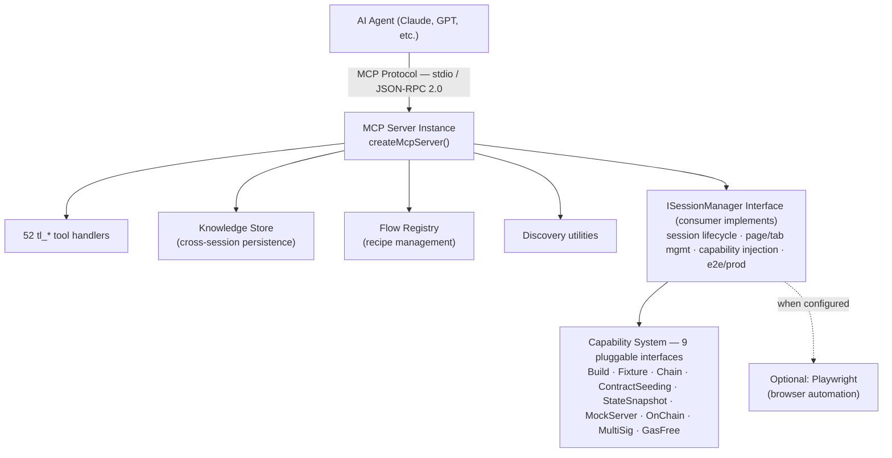

# TronLink MCP Core 

## Overview

**GitHub**: [https://github.com/TronLink/tronlink-mcp-core](https://github.com/TronLink/tronlink-mcp-core)

**@tronlink/tronlink-mcp-core** is the foundational framework library for building TronLink MCP (Model Context Protocol) servers. It is not a standalone application — consumers must implement the `ISessionManager` interface and inject capabilities to create a working server.

**Key Highlights:**
- Interface-driven, pluggable architecture with **9 capability interfaces**
- **52 pre-defined tool handlers** with Zod-validated schemas
- Built-in Knowledge Store for cross-session learning and step replay
- Flow Recipe system for codifying multi-step workflows
- Standardized response format with a documented error-code table (`code` / `retryable` / `hint`)
- Dual-mode support: Playwright (UI automation) + Direct API (on-chain)

---

## Architecture



**Design Principles:**
1. **Interface-driven** — All major components use interfaces for extensibility
2. **Composition over inheritance** — Capabilities are injected, not inherited
3. **Singleton patterns** — SessionManager, KnowledgeStore, FlowRegistry use global holders
4. **Pre-checks** — On-chain tools validate before execution
5. **Data redaction** — Knowledge store automatically masks sensitive fields

---

## Relationship to mcp-server-tronlink

| Aspect | tronlink-mcp-core | mcp-server-tronlink |
|--------|-------------------|---------------------|
| Type | Core library (framework) | Standalone MCP server |
| Role | Defines interfaces, tools, protocol | Concrete implementation |
| Usage | Import via npm, extend | Direct CLI invocation |
| Extensibility | 9 pluggable capability interfaces | Pre-configured capabilities |
| Dependency | None (it IS the dependency) | Depends on @tronlink/tronlink-mcp-core |

**mcp-server-tronlink is a consumer of tronlink-mcp-core.** The core defines WHAT tools exist; the server provides HOW they work.

---

## ISessionManager Interface

The critical interface that consumers must implement (25+ methods):

### Session Lifecycle
```typescript
hasActiveSession(): boolean
getSessionId(): string
getSessionState(): SessionState
getSessionMetadata(): SessionMetadata
launch(input: LaunchInput): Promise<LaunchResult>
cleanup(): Promise<void>
```

### Page Management
```typescript
getPage(): Page
setActivePage(page: Page): void
getTrackedPages(): TrackedPage[]
classifyPageRole(page: Page): PageRole
getContext(): ContextInfo
```

### Extension State
```typescript
getExtensionState(): Promise<ExtensionState>
```

### Accessibility References
```typescript
setRefMap(map: Map<string, any>): void
getRefMap(): Map<string, any>
clearRefMap(): void
resolveA11yRef(ref: string): any
```

### Navigation
```typescript
navigateToHome(): Promise<void>
navigateToSettings(): Promise<void>
navigateToUrl(url: string): Promise<void>
navigateToNotification(): Promise<void>
waitForNotificationPage(timeoutMs?: number): Promise<Page>
```

### Screenshots
```typescript
screenshot(options?: ScreenshotOptions): Promise<ScreenshotResult>
```

### Capability Getters (9 optional)
```typescript
getBuildCapability(): BuildCapability | undefined
getFixtureCapability(): FixtureCapability | undefined
getChainCapability(): ChainCapability | undefined
getContractSeedingCapability(): ContractSeedingCapability | undefined
getStateSnapshotCapability(): StateSnapshotCapability | undefined
getMockServerCapability(): MockServerCapability | undefined
getOnChainCapability(): OnChainCapability | undefined
getMultiSigCapability(): MultiSigCapability | undefined
getGasFreeCapability(): GasFreeCapability | undefined
```

### Environment
```typescript
getEnvironmentMode(): 'e2e' | 'prod'
setContext(context: string, options?: any): Promise<void>
getContextInfo(): ContextInfo
```

---

## 9 Capability Interfaces

Each capability is optional and independently injectable:

### 1. BuildCapability
Build TronLink extension from source.
```typescript
interface BuildCapability {
  build(options?: BuildOptions): Promise<BuildResult>
}
```

### 2. FixtureCapability
Manage wallet state JSON (default, onboarding, custom presets).
```typescript
interface FixtureCapability {
  applyPreset(preset: string): Promise<void>
  getAvailablePresets(): string[]
  exportState(): Promise<WalletState>
  importState(state: WalletState): Promise<void>
}
```

### 3. ChainCapability
Control local TRON node (tron-quickstart, etc.).
```typescript
interface ChainCapability {
  startNode(): Promise<void>
  stopNode(): Promise<void>
  getNodeStatus(): Promise<NodeStatus>
  fundAccount(address: string, amount: number): Promise<string>
}
```

### 4. ContractSeedingCapability
Deploy smart contracts (TRC20/721/1155/10/multisig/staking/energy_rental).
```typescript
interface ContractSeedingCapability {
  seedContract(type: string, options?: any): Promise<ContractInfo>
  seedContracts(specs: ContractSpec[]): Promise<ContractInfo[]>
  getContractAddress(name: string): string | undefined
  listContracts(): ContractInfo[]
}
```

### 5. StateSnapshotCapability
Extract wallet state from UI.
```typescript
interface StateSnapshotCapability {
  getSnapshot(): Promise<StateSnapshot>  // screen, address, balance, energy, bandwidth
}
```

### 6. MockServerCapability
Mock API server for isolated testing.
```typescript
interface MockServerCapability {
  start(config?: MockConfig): Promise<void>
  stop(): Promise<void>
  addRoute(route: MockRoute): void
  getRequests(): MockRequest[]
}
```

### 7. OnChainCapability
Direct on-chain operations via TronGrid REST API.
```typescript
interface OnChainCapability {
  getAddress(): Promise<AddressResult>
  getAccount(address?: string): Promise<AccountResult>
  getTokens(address?: string): Promise<TokensResult>
  send(params: SendParams): Promise<SendResult>
  getTransaction(txId: string): Promise<TxResult>
  getHistory(params?: HistoryParams): Promise<HistoryResult>
  stake(params: StakeParams): Promise<StakeResult>
  getStakingInfo(address?: string): Promise<StakingResult>
  resource(params: ResourceParams): Promise<ResourceResult>
  swap(params: SwapParams): Promise<SwapResult>
  swapV3(params: SwapV3Params): Promise<SwapResult>
  setupMultisig(params: MultisigSetupParams): Promise<MultisigResult>
  createMultisigTx(params: MultisigTxParams): Promise<MultisigTxResult>
  signMultisigTx(params: SignMultisigParams): Promise<SignResult>
}
```

### 8. MultiSigCapability
Multi-signature service integration (REST + WebSocket).
```typescript
interface MultiSigCapability {
  queryAuth(address: string): Promise<AuthResult>
  submitTransaction(params: SubmitParams): Promise<SubmitResult>
  queryTransactionList(params: ListParams): Promise<TxListResult>
  connectWebSocket(params: WsParams): Promise<void>
  disconnectWebSocket(): Promise<void>
}
```

### 9. GasFreeCapability
Gas-free TRC20 transfer service.
```typescript
interface GasFreeCapability {
  getAccount(address: string): Promise<GasFreeAccountResult>
  getTransactions(params: GasFreeTxParams): Promise<GasFreeTxResult>
  send(params: GasFreeSendParams): Promise<GasFreeSendResult>
}
```

---

## 52 Tool Definitions

All tools use the `tl_` prefix. Organized into 13 categories:

> **Schema SSOT.** Every tool's `inputSchema` is generated from the Zod schemas in [`src/mcp-server/schemas.ts`](https://github.com/TronLink/tronlink-mcp-core/blob/main/src/mcp-server/schemas.ts) and surfaced at runtime via `list_tools`. Tables below list **name + one-line description only**; for parameter types, required fields, enums, and defaults, either call `list_tools` against a running server, or read the Zod source. The downstream [`mcp-server-tronlink` page](mcp-server-tronlink.md#selected-tool-schemas-inline-mirror) mirrors JSON Schema for a curated set of 7 high-impact tools (`tl_chain_send`, `tl_chain_swap_v3`, `tl_chain_stake`, `tl_multisig_submit_tx`, `tl_gasfree_send`, `tl_chain_get_account`, `tl_evaluate`) — useful when writing a call site without an MCP session open. The SSOT is still this package.

### 1. Session Management (2)
| Tool | Description |
|------|-------------|
| `tl_launch` | Launch browser with extension |
| `tl_cleanup` | Close browser and services |

### 2. State & Discovery (4)
| Tool | Description |
|------|-------------|
| `tl_get_state` | Get wallet state |
| `tl_describe_screen` | Screen description with state + testIds + a11y + screenshot |
| `tl_list_testids` | List data-testid attributes |
| `tl_accessibility_snapshot` | Get accessibility tree with refs (e1, e2...) |

### 3. Navigation (4)
| Tool | Description |
|------|-------------|
| `tl_navigate` | Navigate to TronLink screen or URL |
| `tl_switch_to_tab` | Switch tabs by role/URL |
| `tl_close_tab` | Close tabs |
| `tl_wait_for_notification` | Wait for confirmation popups |

### 4. UI Interaction (6)
| Tool | Description |
|------|-------------|
| `tl_click` | Click elements (a11yRef, testId, selector) |
| `tl_type` | Type text into inputs |
| `tl_wait_for` | Wait for element state |
| `tl_scroll` | Scroll page/element |
| `tl_keyboard` | Send keyboard events |
| `tl_evaluate` | Execute JavaScript |

### 5. Screenshots & Clipboard (2)
| Tool | Description |
|------|-------------|
| `tl_screenshot` | Capture screen |
| `tl_clipboard` | Read/write clipboard |

### 6. Contract Deployment — e2e only (4)
| Tool | Description |
|------|-------------|
| `tl_seed_contract` | Deploy single contract |
| `tl_seed_contracts` | Deploy multiple contracts |
| `tl_get_contract_address` | Query contract address |
| `tl_list_contracts` | List deployed contracts |

### 7. Context Management (2)
| Tool | Description |
|------|-------------|
| `tl_set_context` | Switch e2e/prod mode |
| `tl_get_context` | Get context info |

### 8. Knowledge Store (4)
| Tool | Description |
|------|-------------|
| `tl_knowledge_last` | Get last N steps |
| `tl_knowledge_search` | Search history |
| `tl_knowledge_summarize` | Generate recipe |
| `tl_knowledge_sessions` | List sessions |

### 9. Flow Recipes (1)
| Tool | Description |
|------|-------------|
| `tl_list_flows` | List/get flow recipes |

### 10. Batch Execution (1)
| Tool | Description |
|------|-------------|
| `tl_run_steps` | Execute multiple steps sequentially |

### 11. On-Chain Operations (14)
| Tool | Description |
|------|-------------|
| `tl_chain_get_address` | Get address from private key |
| `tl_chain_get_account` | Query account details |
| `tl_chain_get_tokens` | Query TRC10/TRC20 balances |
| `tl_chain_send` | Send TRX/TRC10/TRC20 |
| `tl_chain_get_tx` | Get transaction details |
| `tl_chain_get_history` | Query tx history |
| `tl_chain_stake` | Freeze/unfreeze TRX (Stake 2.0) |
| `tl_chain_get_staking` | Query staking info |
| `tl_chain_resource` | Delegate/undelegate resources |
| `tl_chain_swap` | SunSwap V2 swap |
| `tl_chain_swap_v3` | SunSwap V3 swap |
| `tl_chain_setup_multisig` | Configure multisig permissions |
| `tl_chain_create_multisig_tx` | Create unsigned multisig tx |
| `tl_chain_sign_multisig_tx` | Sign multisig transaction |

### 12. Multi-Signature (5)
| Tool | Description |
|------|-------------|
| `tl_multisig_query_auth` | Query multisig permissions |
| `tl_multisig_submit_tx` | Submit signed tx |
| `tl_multisig_list_tx` | List multisig transactions |
| `tl_multisig_connect_ws` | Connect WebSocket |
| `tl_multisig_disconnect_ws` | Disconnect WebSocket |

### 13. GasFree (3)
| Tool | Description |
|------|-------------|
| `tl_gasfree_get_account` | Query eligibility & quota |
| `tl_gasfree_get_transactions` | Query tx history |
| `tl_gasfree_send` | Send with zero gas |

---

## Standardized Response Format

All tools return a consistent structure:

```typescript
// Success
{
  ok: true,
  result: { /* tool-specific data */ },
  meta: {
    timestamp: "2026-03-09T10:15:23.456Z",
    sessionId: "tl-1741504523",
    durationMs: 234
  }
}

// Error
{
  ok: false,
  error: {
    code: "TL_CLICK_FAILED",       // stable code — see table below
    message: "Element not found",
    retryable: false,              // explicit hint for agents
    hint: "Re-snapshot the page and retry with a fresh a11yRef.",
    details: { /* optional */ }
  },
  meta: { timestamp, sessionId, durationMs, schemaVersion: "1.0" }
}
```

### Error Codes

This is the single source of truth (SSOT) for error codes returned by every tool in this framework. Downstream servers (`mcp-server-tronlink`, `mcp-tronlink-signer`) inherit these codes and may extend them. `retryable` reflects framework-level safety; an agent **must** still apply the side-effect classification of the calling tool — never auto-retry a Remote Write whose outcome is unknown, regardless of `retryable`.

| Code | Retryable | Hint | Typical trigger |
|------|:---:|------|-----------------|
| `TL_BUILD_FAILED` | false | Inspect build logs; fix source/config before retrying. | `tl_launch` with `BuildCapability` enabled |
| `TL_SESSION_ALREADY_RUNNING` | false | Call `tl_cleanup` before launching a new session. | `tl_launch` while a session is active |
| `TL_NO_ACTIVE_SESSION` | false | Call `tl_launch` first. | Any session-bound tool without a session |
| `TL_LAUNCH_FAILED` | true | Transient browser/extension boot failure; retry once. | `tl_launch` |
| `TL_INVALID_INPUT` | false | Fix the arguments; do not retry with the same payload. | Zod schema validation |
| `TL_NAVIGATION_FAILED` | true | Page may still be transitioning; wait for the target screen and retry. | `tl_navigate`, `tl_switch_to_tab` |
| `TL_TARGET_NOT_FOUND` | false | Refresh refs via `tl_accessibility_snapshot` and retry with a fresh ref. | `tl_click`, `tl_type`, `tl_wait_for` |
| `TL_CLICK_FAILED` | true | Element may have re-rendered; refresh refs and retry once. | `tl_click` |
| `TL_TYPE_FAILED` | true | Same as click — refresh refs and retry once. | `tl_type` |
| `TL_WAIT_TIMEOUT` | true | Increase the timeout or wait on a different selector. | `tl_wait_for`, `tl_wait_for_notification` |
| `TL_SCREENSHOT_FAILED` | true | Transient; retry. | `tl_screenshot`, `tl_describe_screen` |
| `TL_CAPABILITY_NOT_AVAILABLE` | false | The session was launched without this capability; reconfigure and relaunch. | Any tool that requires an optional capability |
| `TL_CHAIN_QUERY_FAILED` | true | TronGrid transient or rate-limited; back off and retry. | `tl_chain_get_*` |
| `TL_CHAIN_SEND_FAILED` | false | Do **not** auto-retry. Verify on-chain state with `tl_chain_get_tx` before re-issuing. | `tl_chain_send`, `tl_chain_stake`, `tl_chain_resource` |
| `TL_CHAIN_SWAP_FAILED` | false | Same as send — confirm the previous tx did not land before retrying. | `tl_chain_swap`, `tl_chain_swap_v3` |
| `TL_GASFREE_QUERY_FAILED` | true | Transient; retry. | `tl_gasfree_get_account`, `tl_gasfree_get_transactions` |
| `TL_GASFREE_SEND_FAILED` | false | Do **not** auto-retry; query the GasFree service for the latest status. | `tl_gasfree_send` |
| `TL_MULTISIG_QUERY_FAILED` | true | Transient; retry. | `tl_multisig_query_auth`, `tl_multisig_list_tx` |
| `TL_MULTISIG_SUBMIT_FAILED` | false | Do **not** auto-retry; the request may already have been accepted. | `tl_multisig_submit_tx` |
| `TL_MULTISIG_WS_FAILED` | true | Reconnect the WebSocket. | `tl_multisig_connect_ws` |
| `TL_INTERNAL_ERROR` | true | Generic framework failure; retry once and escalate with logs. | Any tool |

Custom codes added by downstream servers must follow these rules:

- Never reuse a code listed above with a different meaning.
- `retryable` is required for every new code.
- Meaning is stable within a major version.
- New codes are documented in the consuming server's docs, not silently introduced.

---

## Knowledge Store

Cross-session learning and step replay system.

### Storage Structure
```text
test-artifacts/llm-knowledge/
├── tl-1741504523/
│   ├── session.json
│   └── steps/
│       ├── 2026-03-09T10-15-23-456Z-tl_click.json
│       └── ...
└── tl-1741504600/
    └── ...
```

### Features
- **Auto-recording:** Every tool invocation is logged (timestamp, screen, target, result)
- **Sensitive data redaction:** Passwords, mnemonics, private keys, seeds are automatically masked
- **Search:** Query by tool name, screen, testId, accessibility name
- **Summarization:** Generate reusable "recipes" from session history
- **Session management:** List sessions with metadata

---

## Flow Recipe System

Codifies common multi-step workflows with template parameters.

### FlowRecipe Structure
```typescript
{
  id: "transfer_trx",
  name: "Send TRX",
  description: "Transfer TRX to another address",
  context: "both",                      // "playwright" | "api" | "both"
  preconditions: ["wallet unlocked"],
  params: [
    { name: "recipient", description: "Target TRON address", required: true },
    { name: "amount", description: "TRX amount", required: true }
  ],
  steps: [
    { tool: "navigate", input: { target: "send" } },
    { tool: "type", input: { testId: "address-input", text: "{{recipient}}" } },
    { tool: "type", input: { testId: "amount-input", text: "{{amount}}" } },
    { tool: "click", input: { a11yRef: "e5" } }
  ],
  tags: ["transfer", "basic"]
}
```

### FlowRegistry
- `register(recipe)` — Register a new flow recipe
- `get(id)` — Get recipe by ID
- `list(filter?)` — List recipes by tag, context, or search
- Singleton pattern via global holder

---

## Element Targeting (3 Methods)

```typescript
// 1. Accessibility Reference (recommended)
tl_click({ a11yRef: "e5" })

// 2. data-testid
tl_click({ testId: "send-button" })

// 3. CSS Selector
tl_click({ selector: ".confirm-btn" })
```

Accessibility references come from `tl_accessibility_snapshot` output — the most reliable targeting method.

---

## Installation & Usage

### Install
```bash
npm install @tronlink/tronlink-mcp-core
```

### Basic Setup
```typescript
import {
  createMcpServer,
  setSessionManager,
  type ISessionManager,
} from '@tronlink/tronlink-mcp-core';

// 1. Implement ISessionManager
class MySessionManager implements ISessionManager {
  // ... implement all 25+ methods
}

// 2. Register
setSessionManager(new MySessionManager());

// 3. Create and start server
const server = createMcpServer({
  name: 'My TronLink Server',
  version: '1.0.0',
});

await server.start();
```

---

## Project Structure

```text
tronlink-mcp-core/
├── src/
│   ├── index.ts                           # Public API exports
│   ├── mcp-server/
│   │   ├── server.ts                      # createMcpServer() factory
│   │   ├── session-manager.ts             # ISessionManager interface
│   │   ├── knowledge-store.ts             # Persistent step recording
│   │   ├── discovery.ts                   # Page inspection utilities
│   │   ├── schemas.ts                     # Zod validation schemas
│   │   ├── constants.ts                   # TIMEOUTS, LIMITS, URLs, SCREENS
│   │   ├── tools/
│   │   │   ├── definitions.ts             # Tool registry & routing
│   │   │   ├── run-tool.ts                # Execution wrapper (auto-logs)
│   │   │   ├── launch.ts                  # tl_launch
│   │   │   ├── cleanup.ts                 # tl_cleanup
│   │   │   ├── state.ts                   # tl_get_state
│   │   │   ├── navigation.ts              # Navigation tools
│   │   │   ├── interaction.ts             # UI interaction tools
│   │   │   ├── discovery-tools.ts         # Element discovery
│   │   │   ├── screenshot.ts              # Screenshot capture
│   │   │   ├── on-chain.ts                # 14 on-chain tools
│   │   │   ├── multisig.ts                # 5 multisig tools
│   │   │   ├── gasfree.ts                 # 3 gasfree tools
│   │   │   ├── knowledge.ts               # Knowledge store tools
│   │   │   ├── flows.ts                   # Flow listing
│   │   │   ├── batch.ts                   # Batch execution
│   │   │   └── helpers.ts                 # Shared utilities
│   │   ├── types/
│   │   │   ├── responses.ts               # McpResponse types
│   │   │   ├── errors.ts                  # ErrorCodes enum
│   │   │   ├── session.ts                 # Session types
│   │   │   ├── step-record.ts             # Step recording types
│   │   │   ├── tool-inputs.ts             # All tool input types
│   │   │   └── tool-outputs.ts            # All tool output types
│   │   └── utils/
│   │       ├── response.ts                # createSuccessResponse / createErrorResponse
│   │       ├── errors.ts                  # extractErrorMessage
│   │       └── zod-to-json-schema.ts      # Zod → JSON Schema conversion
│   ├── capabilities/
│   │   ├── types.ts                       # 9 capability interfaces
│   │   └── context.ts                     # Environment config types
│   ├── flows/
│   │   ├── types.ts                       # FlowRecipe, FlowParam types
│   │   └── registry.ts                    # FlowRegistry class
│   ├── launcher/
│   │   ├── extension-id-resolver.ts       # Extension ID extraction
│   │   └── extension-readiness.ts         # Extension load detection
│   └── utils/
│       └── index.ts                       # generateSessionId, etc.
├── dist/                                  # Compiled output + .d.ts
├── package.json
├── tsconfig.json
└── README.md
```

---

## Dependencies

| Package | Version | Purpose |
|---------|---------|---------|
| `@modelcontextprotocol/sdk` | ^1.12.0 | MCP protocol implementation |
| `zod` | ^3.23.0 | Input validation schemas |

**Peer Dependencies (optional):**

| Package | Version | Purpose |
|---------|---------|---------|
| `playwright` | ^1.49.0 | Browser automation (Playwright mode only) |
| `@playwright/test` | ^1.49.0 | Test utilities |

---

## Build & Development

```bash
npm run build      # Compile TypeScript to dist/
npm run dev        # Watch mode
npm run test       # Run Vitest tests
npm run lint       # ESLint
npm run clean      # Remove dist/
```

**Output:** Compiled JavaScript + type definitions in `dist/`.

---

## Key Design Patterns

1. **Global Singletons** — `setSessionManager()` / `getSessionManager()`, `setKnowledgeStore()` / `getKnowledgeStore()`, `FlowRegistry.getInstance()`
2. **Composition over Inheritance** — Capabilities injected via getter methods, not class hierarchy
3. **Interface Segregation** — Each capability has a focused, minimal interface
4. **Pre-checks** — On-chain tools validate balances, permissions, quotas before sending transactions
5. **Data Redaction** — Knowledge store auto-masks password, mnemonic, private_key, seed fields
6. **Standardized Responses** — Consistent `{ ok, result/error, meta }` structure across all 52 tools
7. **Template System** — Flow recipes use `{{param}}` placeholders for reusable workflows

## Version & License

- **Package:** `@tronlink/tronlink-mcp-core` v0.1.0
- **License:** MIT — `SPDX-License-Identifier: MIT`
- **Changelog / releases:** [https://github.com/TronLink/tronlink-mcp-core/releases](https://github.com/TronLink/tronlink-mcp-core/releases) — no GitHub-tagged releases yet; pre-1.0 ships via `package.json` version bumps. Track changes by commit until the first tag.

### Compatibility & migration policy

This package is **the SSOT** for tool schemas, error codes, and `meta.schemaVersion` consumed by `mcp-server-tronlink` and any downstream MCP server built on this core. The compatibility surface is therefore wider than a typical library:

- **Semver.** Pre-1.0: a **minor** bump may change the `ISessionManager` interface, capability shapes, or `Tool[]` registration order; a **patch** will not. Post-1.0: standard semver — major-only breaking changes.
- **Stable contracts** (won't change in a patch):
    - The `error.code` enum (the SSOT exported as `ERROR_CODES`) — adding a new code is non-breaking; renaming or removing one is breaking.
    - The `{ ok, result/error, meta }` response envelope and `meta.schemaVersion` major component.
    - Tool names and the **shape** of each tool's `inputSchema` (adding optional fields is non-breaking; renaming or making a field required is breaking).
    - The 9 capability interfaces (`OnChainCapability`, `MultiSigCapability`, …) — adding an optional method is non-breaking.
- **Volatile contracts** (may change at any time):
    - Internal helper exports under `src/internal/*`, `Knowledge Store` keys, recipe-runner internals.
    - Pre-check error `details` strings (branch on `code`, not `details.reason`).
- **Deprecation window.** A deprecated tool / field / capability method stays present for at least one minor cycle alongside its replacement, marked with `meta.deprecated` in `list_tools` output; removal lands no earlier than the cycle after.
- **Adopting downstream.** Bump the `@tronlink/tronlink-mcp-core` peer / dependency only after re-running your downstream's `list_tools` snapshot test against the new core; assert `meta.schemaVersion` major matches the version your harness was written for.
