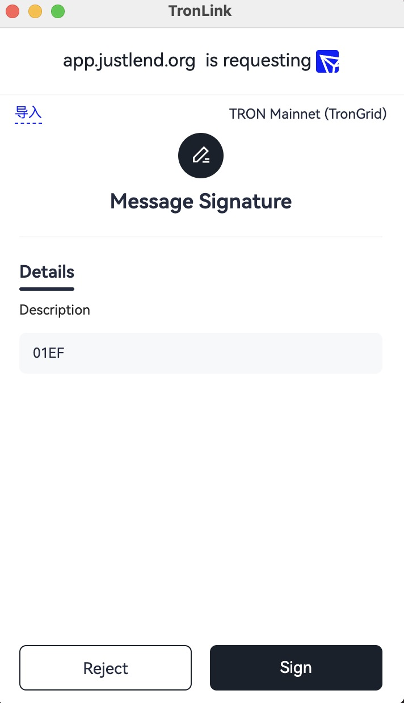

# Message Signature

## Overview

DApp requires users to sign a hex message. The signed message will be forwarded to the back-end to verify whether a user's login is legitimate.

> **Prerequisite:** The DApp connection has been authorized via `eth_requestAccounts` (see [Start Developing](getting-started.md#request-authorization)).

## Specification

### Example

```javascript
const tronweb = window.tron.tronWeb;
try {
  const message = "0x1e"; // any hex string
  const signedString = await tronweb.trx.signMessageV2(message);
} catch (e) {}
```
### Parameters

`window.tron.tronWeb.trx.signMessageV2` accepts a hexadecimal string as the parameter. The string represents the content to be signed.

### Returns

If the user chooses to sign in the pop-up window, the DApp will get the signed hexadecimal string. For example:

```text
    0xb0e0b150b9b10dc348f25c7f38fc87f16e18c0d230d23946aac519a5ad9e45937f656012d33c09e9d9dec00b03fbb304e797f8991bb823dce676ac91e03a55991b
```

If an error occurs, the following information will be returned:

```text
    
    Uncaught (in promise) Invalid transaction provided
```

## Interaction

When “tronweb.trx.signMessageV2(message);” is executed, a pop-up window will show in the TronLink wallet asking the user to confirm, as shown below. The message content will be in hex: 



If the user chooses “Reject” in the pop-up window, an exception will be thrown, which the developer can catch for further processing.

## Errors

| Code | Meaning | Where it comes from | Retryable? |
| :---: | --- | --- | :---: |
| `4001` | User clicked **Reject** in the signing popup | `tronWeb.trx.signMessageV2(message)` | No — user declined |
| (thrown) | `Invalid transaction provided` / non-hex input | `signMessageV2(...)` argument validation | No — pass a valid hex string |
| (thrown) | Provider not injected / wallet not authorized | `window.tron.tronWeb` undefined | No — connect first via `eth_requestAccounts` |

For cross-surface translation (DApp ↔ DeepLink ↔ MCP ↔ CLI) see the [Error Code Map](../reference/error-code-map.md).

