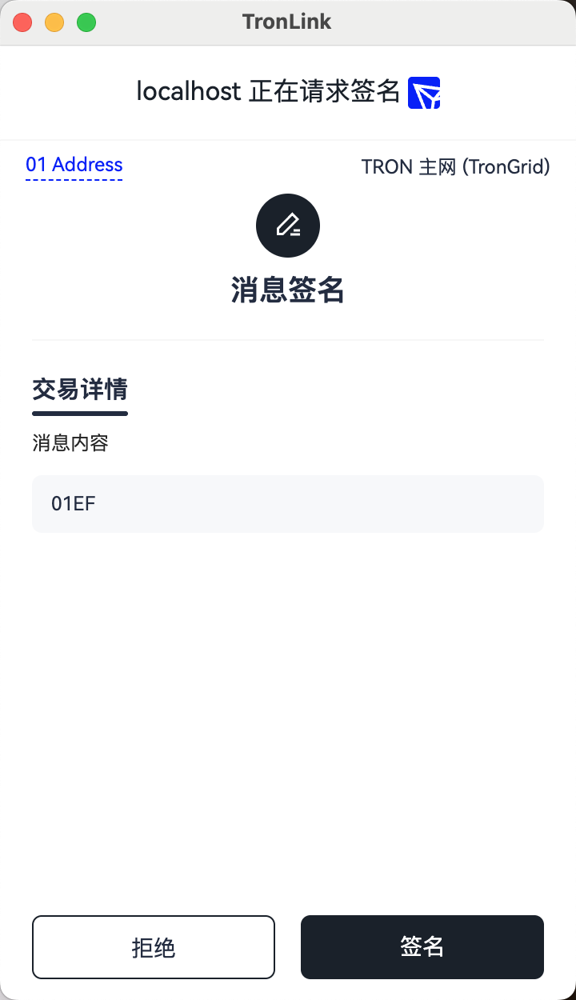

# 消息签名

## 简介

DApp 需要用户对一个 hex 消息签名，签名后消息转发给后端进行验签，以此判断用户合法登录。

> **前提条件：** 已通过 `eth_requestAccounts` 完成 DApp 连接授权（参见[开始开发](getting-started.md)）。

## 技术规范

### 代码示例

```javascript
const tronweb = window.tron.tronWeb;
try {
  const message = "0x01EF"; // any hex string
  const signedString = await tronweb.trx.signMessageV2(message);
} catch (e) {}
```

### 参数

`window.tron.tronWeb.trx.signMessageV2` 接收一个十六进制的字符串作为参数，该字符串表示当前待签名的内容。

### 返回值

如果用户在弹窗中选择签名, DApp 可以得到签名后的十六进制字符串, 比如：

```text
    0xb0e0b150b9b10dc348f25c7f38fc87f16e18c0d230d23946aac519a5ad9e45937f656012d33c09e9d9dec00b03fbb304e797f8991bb823dce676ac91e03a55991b
```

如果报错，则会返回如下信息：

```text
    Uncaught (in promise) Invalid transaction provided
```

## 交互流程

当代码执行到`await tronweb.trx.signMessageV2(message);`时，TronLink 钱包会提示弹窗，需要用户进行确认， 如下图, 其中消息内容会以hex的方式展示：



如果用户在弹窗中选择【拒绝】，则会抛出异常，开发者可捕获此异常进行业务处理。

## 错误码

| 码 | 含义 | 来源 | 可重试? |
| :---: | --- | --- | :---: |
| `4001` | 用户在签名弹窗里点【拒绝】 | `tronWeb.trx.signMessageV2(message)` | 否——用户拒绝 |
| (抛出) | `Invalid transaction provided` / 非 hex 输入 | `signMessageV2(...)` 参数校验 | 否——传合法的 hex 字符串 |
| (抛出) | provider 未注入 / 钱包未授权 | `window.tron.tronWeb` 未定义 | 否——先通过 `eth_requestAccounts` 连接 |

跨 surface 的码对照见[错误码对照表](../reference/error-code-map.md)。

