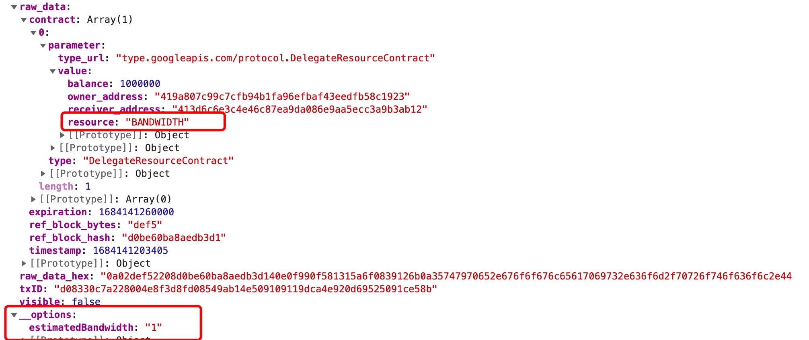

# Stake2.0

> **Prerequisite:** The DApp connection has been authorized via `eth_requestAccounts` (see [Start Developing](getting-started.md#request-authorization)).

When generating stake 2.0 transactions for DApps, for transactions of the `DelegateResourceContract` or `UnDelegateResourceContract` type, in order to display the estimated results during signature using the Tronlink extension, it is necessary to add the "__options" field to the transaction body.

Inside "__options", there are two values: estimatedBandwidth and estimatedEnergy, which correspond to the estimated energy and bandwidth of the delegate and reclaim operations, respectively.

When generating stake 2.0 transactions using a non-tronlink extension injected tronweb, in order to display the corresponding type of resource for `DelegateResourceContract` or `UnDelegateResourceContract` type transactions during signature, the "__resource" field needs to be added to the transaction body. (Adding “resource” is only necessary for tronWeb that is not injected by a tronlink extension. TronWeb that is injected by tronlink extension does not require.)

The "__resource" field corresponds to the values "BANDWIDTH" and "ENERGY".



<style>
img {
  max-width: 100%!important;
}
</style>

For example:

```javascript
    const transaction = await tronWeb.transactionBuilder.delegateResource(10e6, 'receiverAddress', 'BANDWIDTH', 'ownerAddress', false);
    transaction.raw_data.contract[0].parameter.value.resource = "BANDWIDTH"
    transaction.__options = {"estimatedBandwidth": 1}
```

The specific calculation logic of estimatedEnergy and estimatedBandwidth can be found in the last chapter of the "[<a class="tooltip" href="https://coredevs.medium.com/stake-2-0-adaption-faq-66bafdf53606" data-tooltip="https://coredevs.medium.com/stake-2-0-adaption-faq-66bafdf53606">Stake 2.0 Adaptation FAQ</a>](https://coredevs.medium.com/stake-2-0-adaption-faq-66bafdf53606)": "How to convert resource share to amount?"

## Errors

| Code | Meaning | Where it comes from | Retryable? |
| :---: | --- | --- | :---: |
| `4001` | User clicked **Reject** in the signing popup | `tronWeb.trx.sign(tx)` for the delegate / undelegate tx | No — user declined |
| (thrown) | Missing `__options` or `__resource` — signing UI cannot render the estimate | `tronWeb.trx.sign(tx)` | No — set both fields per the rules above |
| (thrown) | Insufficient TRX staked / nothing to undelegate | `delegateResource` / `undelegateResource` builder | No — fix the on-chain state first |
| `REVERT` / `OUT_OF_ENERGY` / `FAILED` | Broadcast succeeded but execution failed on-chain | `sendRawTransaction` result or `getTransactionInfo` | **No — the tx is final; never auto-retry** |

For cross-surface translation see the [Error Code Map](../reference/error-code-map.md).

