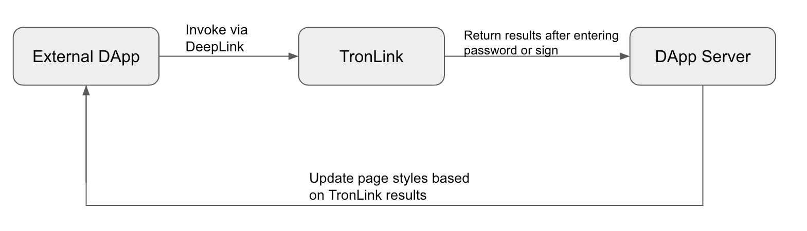

# DeepLink

DApps and H5 pages can launch the TronLink App to open the wallet, log in, make transfers, sign transactions, open DApps in the wallet, and more via DeepLink.



<style>
img {
  max-width: 100%!important;
}
</style>

Process Flowchart

Please be aware that only DApps that have been added to the whitelist will be able to establish a successful connection with TronLink. Kindly fill out the whitelist request form here: [Start](https://docs.google.com/forms/d/e/1FAIpQLSdFmYGxVZzwCSsvmdOTq064sxWD22STYth1g5GO5zn3OrB5Jw/viewform?usp=sf_link)


## Open Wallet

### Launch TronLink wallet via DeepLink

```shell  
    // Tronlink-v4.10.0
    // Link
    <a href='tronlinkoutside://pull.activity?param={}'>Open Tronlink</a>
```
```shell  
    // The parameter of param is the protocol data in json format
    // Note: json.toString needs to be encoded with urlencode
    {
    	"action": "open",
    	"protocol": "tronlink",
    	"version": "1.0"
    }
```

## Open DApp

### Use DeepLink to launch TronLink and open DApp in the DApp Explorer

```shell  
    // Tronlink-v4.10.0
    // Link
    <a href='tronlinkoutside://pull.activity?param={}'>Open DApp</a>
```
```shell 
    
    //  The parameter of param is the protocol data in json format
    //  Note: json.toString needs to be encoded with urlencode
    {
    	"url": "https://www.tronlink.org/", //target DApp
    	"action": "open",
    	"protocol": "tronlink",
    	"version": "1.0"
    }
```

## Login by TronLink

```shell  
    // Tronlink-v4.11.0
    // Link
    <a href='tronlinkoutside://pull.activity?param={}'>Login/Request Address</a>
```
```shell 
    
    //  The parameter of param is the protocol data in json format
    //  Note: json.toString needs to be encoded with urlencode
    {
      "url": "https://justlend.org/#/home",
      "callbackUrl": "http://xxx/api/tron/v1/callback",
      "dappIcon": "https://test/icon.png",
      "dappName": "Test demo",
      "protocol": "TronLink",
      "version": "1.0",
      "chainId": "0x2b6653dc",
      "action": "login",
      "actionId": "e5471a9c-b0f1-418b-8634-3de60d68a288"
    }
```
```shell  
    {
      "actionId": "e5471a9c-b0f1-418b-8634-3de60d68a288",
      "address": "TSPrmJetAMo6S6RxMd4tswzeRCFVegBNig",
      "code": 0,
      "id": 1780812177,
      "message": "success"
    }
```

## Transfer

```shell
  // Tronlink-v4.11.0
  // Link
  <a href='tronlinkoutside://pull.activity?param={}'>Transfer</a>
```    


```shell    
  {
    "url": "https://justlend.org/#/home",
    "callbackUrl": "http://3.12.131.175:7777/api/tron/v1/callback",
    "dappIcon": "https://test/icon.png",
    "dappName": "Test demo",
    "protocol": "TronLink",
    "version": "1.0",
    "chainId": "0x2b6653dc",
    "memo": "Reward",
    "from": "TSPrmJetAMo6S6RxMd4tswzeRCFVegBNig",
    "to": "TXd9duqtcyyj4pBCKvXKNqmazxxDw5SdBa",
    "loginAddress": "TSPrmJetAMo6S6RxMd4tswzeRCFVegBNig",
    "tokenId": "0",
    "contract": "",
    "amount": "20",
    "action": "transfer",
    "actionId": "408170fc-7919-4459-be5e-05a9d4b4065e"
  }
```
    
```shell    
  {
    "actionId": "099482f0-ee12-4703-bb7b-2e9d8c7c61a1",
    "code": 0,
    "id": 1142367107,
    "message": "success",
    "transactionHash": "e8ffe9b92c771e66999732b810bf2493be389464191040d8666a26dc449fa5f0"
  }
```

## Sign Transaction

```shell
  // Tronlink-v4.11.0
  // Link
  <a href='tronlinkoutside://pull.activity?param={}'>Sign transaction</a>
```

```shell
  // request parameter
  {
    "url": "https://justlend.org/#/home",
    "callbackUrl": "http://3.12.131.175:7777/api/tron/v1/callback",
    "dappIcon": "https://test/icon.png",
    "dappName": "Test demo",
    "protocol": "TronLink",
    "version": "1.0",
    "chainId": "0x2b6653dc",
    "action": "sign",
    "loginAddress": "TSPrmJetAMo6S6RxMd4tswzeRCFVegBNig",
    "method": "transfer(address,uint256)",
    "signType": "signTransaction",
    "data": "{\"visible\":false,\"txID\":\"dcfaf2c2d75d91994f9a23623e905eaa7d74bc804fa5821640111ada3441376a\",\"raw_data\":{\"contract\":[{\"parameter\":{\"value\":{\"data\":\"a9059cbb000000000000000000000000ed87a3ae2bf2ab8b95486a23f224487ad75c60200000000000000000000000000000000000000000000000000000000000000014\",\"owner_address\":\"41b42b84bad413dde093e27d01bb02ed9eede52c43\",\"contract_address\":\"41eca9bc828a3005b9a3b909f2cc5c2a54794de05f\"},\"type_url\":\"type.googleapis.com/protocol.TriggerSmartContract\"},\"type\":\"TriggerSmartContract\"}],\"ref_block_bytes\":\"84e1\",\"ref_block_hash\":\"1731d6450e11a03f\",\"expiration\":1670168865000,\"fee_limit\":100000000,\"timestamp\":1670168805340},\"raw_data_hex\":\"0a0284e122081731d6450e11a03f40e8d1c9eecd305aae01081f12a9010a31747970652e676f6f676c65617069732e636f6d2f70726f746f636f6c2e54726967676572536d617274436f6e747261637412740a1541b42b84bad413dde093e27d01bb02ed9eede52c43121541eca9bc828a3005b9a3b909f2cc5c2a54794de05f2244a9059cbb000000000000000000000000ed87a3ae2bf2ab8b95486a23f224487ad75c6020000000000000000000000000000000000000000000000000000000000000001470dcffc5eecd30900180c2d72f\"}",
    "actionId": "64fcdb39-2cfa-47f2-85bd-d7e8409809ed"
  }
```
```shell 
  // callback parameter
  {
    "actionId": "f5d9791a-c774-4684-805a-83784c0c86ff",
    "code": 0,
    "id": -799302342,
    "message": "success",
    "successful": true,
    "transactionHash": "2fc49e560f648e5ecb455955d8778267ec1f257436425f62393b632c9a7a55ad"
  }
```

## Sign Message
```shell 
    // Tronlink-v4.11.0
    <a href='tronlinkoutside://pull.activity?param={}'>Sign message</a>
```
```shell 
    // request parameter
    {
      "url": "https://justlend.org/#/home",
      "callbackUrl": "http://3.12.131.175:7777/api/tron/v1/callback",
      "dappIcon": "https://test/icon.png",
      "dappName": "Test demo",
      "protocol": "TronLink",
      "version": "1.0",
      "chainId": "0x2b6653dc",
      "loginAddress": "TSPrmJetAMo6S6RxMd4tswzeRCFVegBNig",
      "signType": "signStr",
      "message": "abc",
      "action": "sign",
      "actionId": "50554861-4861-41c4-adf3-abf36213f843"
    }
```    
```shell 
    // callback parameter
    {
      "actionId": "50554861-4861-41c4-adf3-abf36213f843",
      "code": 0,
      "id": 2001871012,
      "message": "success",
      "signedData": "0xffcac5731d9f70a58e5126f44c34b9356ccb9bef53331e33ddab84bb829adc1b77df24362348f8d46e506b489b4af4496600799b173e708faf1b9db99da9d13c1b"
    }
```

## Result Code

| id | Message |  |
|:-------|:-------|:-------|
| 0 | success |  |
| 10001  | Incorrect JSON format   |   |
| 10002  | Missing Action   |   |
| 10003  | Unknown Action   |   |
| 10004  | Missing ActionId   |   |
| 10005  | Incorrect DApp URL format   |   |
| 10006  | Incorrect CallbackUrl format   |   |
| 10007  | Empty DApp name   |   |
| 10008  | Version number not supported   |   |
| 10009  | Current network not supported   |   |
| 10010  | The URL is not supported to open TronLink   |   |
| 10011  | Unknown SignType   |   |
| 10012  | Incorrect Transaction format  |   |
| 10013  | Incorrect Method format   |   |
| 10014  | Incorrect Message format   |   |
| 10015  | Incorrect toAddress   |   |
| 10016  | No wallet created in TronLink   |   |
| 10017  | Incorrect fromAddress   |   |
| 10018  | Incorrect contactAddress   |   |
| 10019  | Incorrect chainId   |   |
| 10020  | Incorrect amount   |   |
| 10021  | The initiating address does not match the current wallet   |   |
| 10022  | incorrect loginAddress   |   |
| 10023  | System contract not support   |   |
| 10024  | Incorrect tokenId   |   |
| 10025  | TokenId & Contract address should not be exist together   |   |
| 300  | Transaction canceled   |   |
| 301  | Transaction executed in TronLink   |   |
| 302  | Broadcast failure - returned with incorrect info   |   |
| -1  | Unknown reason   |   |

