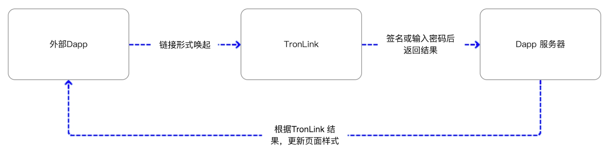

# DeepLink

DApp、H5 应用可以使用 DeepLink 方式拉起 TronLink App 进行打开钱包、登录、转账、签名交易、字符串签名、在钱包中打开 DApp 等操作。



下文每个操作中，`tronlinkoutside://pull.activity?param={}` 的 `param` 参数都是 JSON 格式的协议数据。注意：JSON 字符串放入链接前需要进行 urlencode 编码。

## 打开钱包

使用 DeepLink 方式唤起钱包。可用版本：TronLink v4.10.0 起。

```html
<a href='tronlinkoutside://pull.activity?param={}'>Open Tronlink</a>
```

`param`（请求）：

```json
{
  "action": "open",
  "protocol": "TronLink",
  "version": "1.0"
}
```

## 打开 DApp

使用 DeepLink 方式唤起钱包，并在 DApp 浏览器中打开 DApp。可用版本：TronLink v4.10.0 起。

```html
<a href='tronlinkoutside://pull.activity?param={}'>Open DApp</a>
```

`param`（请求），`url` 为目标 DApp：

```json
{
  "url": "https://www.tronlink.org/",
  "action": "open",
  "protocol": "TronLink",
  "version": "1.0"
}
```

## 登录授权

使用 DeepLink 方式唤起钱包，并在钱包中选择获取钱包地址。可用版本：TronLink v4.11.0 起。

```html
<a href='tronlinkoutside://pull.activity?param={}'>Login/Request Address</a>
```

`param`（请求）：

```json
{
  "url": "https://justlend.org/#/home",
  "callbackUrl": "https://your-backend.example.com/api/tron/v1/callback",
  "dappIcon": "https://your-dapp.example.com/icon.png",
  "dappName": "Test demo",
  "protocol": "TronLink",
  "version": "1.0",
  "chainId": "0x2b6653dc",
  "action": "login",
  "actionId": "e5471a9c-b0f1-418b-8634-3de60d68a288"
}
```

回调：

```json
{
  "actionId": "e5471a9c-b0f1-418b-8634-3de60d68a288",
  "address": "TSPrmJetAMo6S6RxMd4tswzeRCFVegBNig",
  "code": 0,
  "id": 1780812177,
  "message": "success"
}
```

## 转账

使用 DeepLink 方式唤起 TronLink，并发送转账数据，在钱包中转账并广播。可用版本：TronLink v4.11.0 起。

```html
<a href='tronlinkoutside://pull.activity?param={}'>Transfer</a>
```

`param`（请求）：

```json
{
  "url": "https://justlend.org/#/home",
  "callbackUrl": "https://your-backend.example.com/api/tron/v1/callback",
  "dappIcon": "https://your-dapp.example.com/icon.png",
  "dappName": "Test demo",
  "protocol": "TronLink",
  "version": "1.0",
  "chainId": "0x2b6653dc",
  "memo": "Reward",
  "from": "TSPrmJetAMo6S6RxMd4tswzeRCFVegBNig",
  "to": "TXd9duqtcyyj4pBCKvXKNqmazxxDw5SdBa",
  "loginAddress": "TSPrmJetAMo6S6RxMd4tswzeRCFVegBNig",
  "tokenId": "0",
  "contract": "",
  "amount": "20",
  "action": "transfer",
  "actionId": "408170fc-7919-4459-be5e-05a9d4b4065e"
}
```

回调（`actionId` 与请求一致）：

```json
{
  "actionId": "408170fc-7919-4459-be5e-05a9d4b4065e",
  "code": 0,
  "id": 1142367107,
  "message": "success",
  "transactionHash": "e8ffe9b92c771e66999732b810bf2493be389464191040d8666a26dc449fa5f0"
}
```

## 交易签名

可用版本：TronLink v4.11.0 起。

```html
<a href='tronlinkoutside://pull.activity?param={}'>Sign transaction</a>
```

`param`（请求）：

```json
{
  "url": "https://justlend.org/#/home",
  "callbackUrl": "https://your-backend.example.com/api/tron/v1/callback",
  "dappIcon": "https://your-dapp.example.com/icon.png",
  "dappName": "Test demo",
  "protocol": "TronLink",
  "version": "1.0",
  "chainId": "0x2b6653dc",
  "action": "sign",
  "loginAddress": "TSPrmJetAMo6S6RxMd4tswzeRCFVegBNig",
  "method": "transfer(address,uint256)",
  "signType": "signTransaction",
  "data": "{\"visible\":false,\"txID\":\"dcfaf2c2d75d91994f9a23623e905eaa7d74bc804fa5821640111ada3441376a\",\"raw_data\":{\"contract\":[{\"parameter\":{\"value\":{\"data\":\"a9059cbb000000000000000000000000ed87a3ae2bf2ab8b95486a23f224487ad75c60200000000000000000000000000000000000000000000000000000000000000014\",\"owner_address\":\"41b42b84bad413dde093e27d01bb02ed9eede52c43\",\"contract_address\":\"41eca9bc828a3005b9a3b909f2cc5c2a54794de05f\"},\"type_url\":\"type.googleapis.com/protocol.TriggerSmartContract\"},\"type\":\"TriggerSmartContract\"}],\"ref_block_bytes\":\"84e1\",\"ref_block_hash\":\"1731d6450e11a03f\",\"expiration\":1670168865000,\"fee_limit\":100000000,\"timestamp\":1670168805340},\"raw_data_hex\":\"0a0284e122081731d6450e11a03f40e8d1c9eecd305aae01081f12a9010a31747970652e676f6f676c65617069732e636f6d2f70726f746f636f6c2e54726967676572536d617274436f6e747261637412740a1541b42b84bad413dde093e27d01bb02ed9eede52c43121541eca9bc828a3005b9a3b909f2cc5c2a54794de05f2244a9059cbb000000000000000000000000ed87a3ae2bf2ab8b95486a23f224487ad75c6020000000000000000000000000000000000000000000000000000000000000001470dcffc5eecd30900180c2d72f\"}",
  "actionId": "64fcdb39-2cfa-47f2-85bd-d7e8409809ed"
}
```

回调（`actionId` 与请求一致）：

```json
{
  "actionId": "64fcdb39-2cfa-47f2-85bd-d7e8409809ed",
  "code": 0,
  "id": -799302342,
  "message": "success",
  "successful": true,
  "transactionHash": "2fc49e560f648e5ecb455955d8778267ec1f257436425f62393b632c9a7a55ad"
}
```

## 消息签名

可用版本：TronLink v4.11.0 起。

```html
<a href='tronlinkoutside://pull.activity?param={}'>Sign message</a>
```

`param`（请求）：

```json
{
  "url": "https://justlend.org/#/home",
  "callbackUrl": "https://your-backend.example.com/api/tron/v1/callback",
  "dappIcon": "https://your-dapp.example.com/icon.png",
  "dappName": "Test demo",
  "protocol": "TronLink",
  "version": "1.0",
  "chainId": "0x2b6653dc",
  "loginAddress": "TSPrmJetAMo6S6RxMd4tswzeRCFVegBNig",
  "signType": "signStr",
  "message": "abc",
  "action": "sign",
  "actionId": "50554861-4861-41c4-adf3-abf36213f843"
}
```

回调：

```json
{
  "actionId": "50554861-4861-41c4-adf3-abf36213f843",
  "code": 0,
  "id": 2001871012,
  "message": "success",
  "signedData": "0xffcac5731d9f70a58e5126f44c34b9356ccb9bef53331e33ddab84bb829adc1b77df24362348f8d46e506b489b4af4496600799b173e708faf1b9db99da9d13c1b"
}
```

## 回传消息码

> 注意：转账请求中 `tokenId` 与 `contract` 互斥，两者同时传入会返回消息码 `10025`。

| 消息码 | 消息 | 备注 |
|:-------|:-------|:-------|
| 0 | success |  |
| 10001 | Incorrect JSON format |  |
| 10002 | Missing Action |  |
| 10003 | Unknown Action |  |
| 10004 | Missing ActionId |  |
| 10005 | Incorrect DApp URL format |  |
| 10006 | Incorrect CallbackUrl format |  |
| 10007 | Empty DApp name | v1.0 可以为空 |
| 10008 | Version number not supported |  |
| 10009 | Current network not supported |  |
| 10010 | The URL is not supported to open TronLink |  |
| 10011 | Unknown SignType |  |
| 10012 | Incorrect Transaction format |  |
| 10013 | Incorrect Method format |  |
| 10014 | Incorrect Message format |  |
| 10015 | Incorrect toAddress |  |
| 10016 | No wallet created in TronLink |  |
| 10017 | Incorrect fromAddress |  |
| 10018 | Incorrect contractAddress |  |
| 10019 | Incorrect chainId |  |
| 10020 | Incorrect amount |  |
| 10021 | The initiating address does not match the current wallet |  |
| 10022 | Incorrect loginAddress |  |
| 10023 | System contract not support |  |
| 10024 | Incorrect tokenId |  |
| 10025 | TokenId & Contract address should not exist together |  |
| 300 | Transaction canceled |  |
| 301 | Transaction executed in TronLink |  |
| 302 | Broadcast failure - returned with incorrect info |  |
| -1 | Unknown reason |  |
