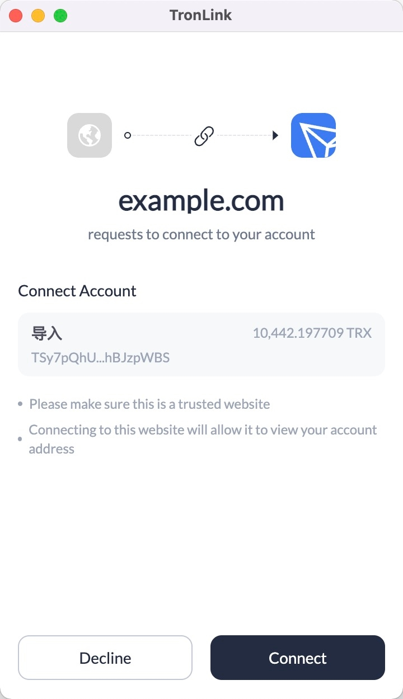
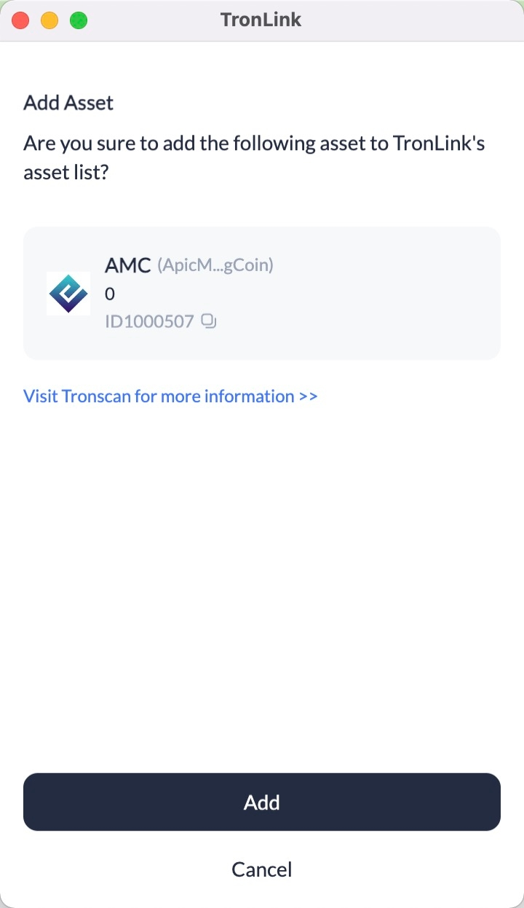
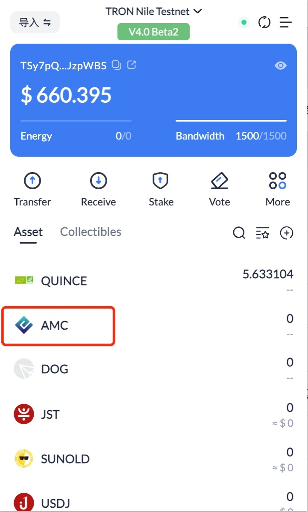
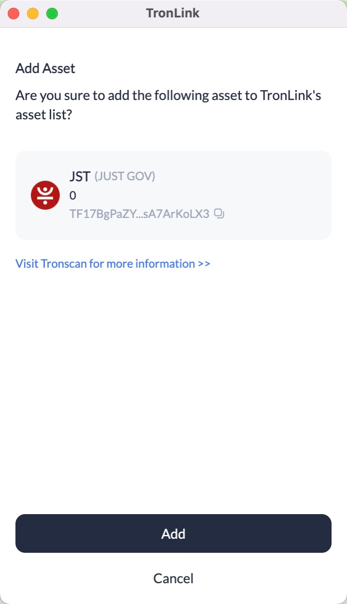
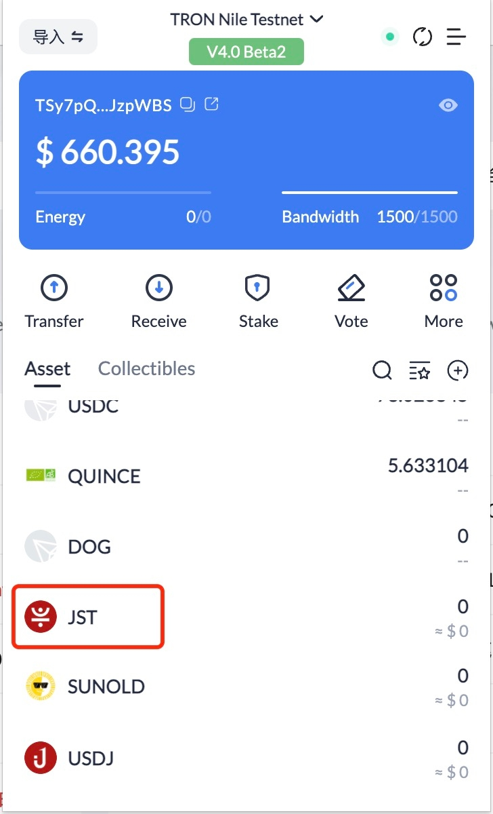
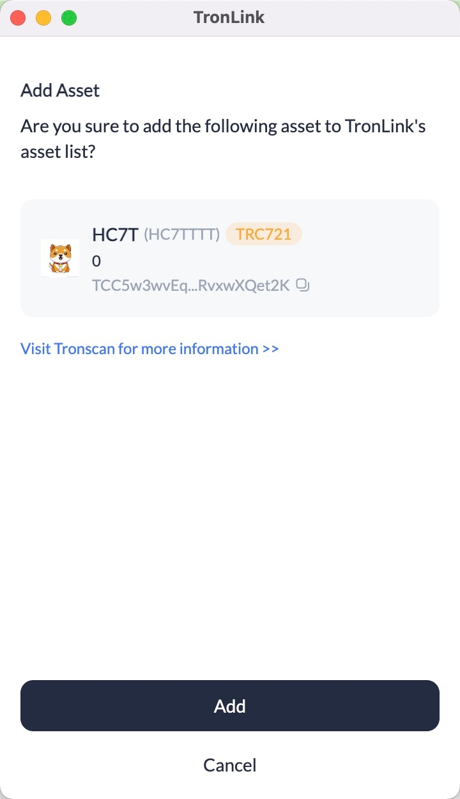
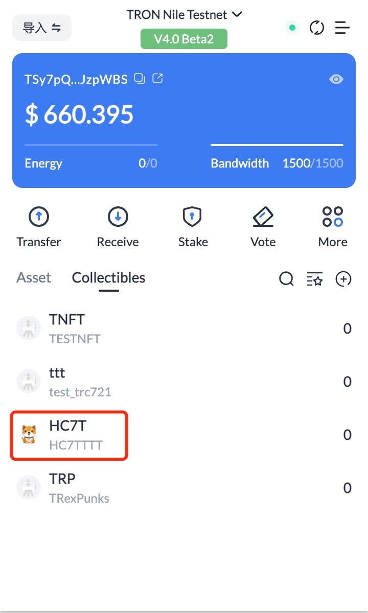

# Request TronLink Extension


## Connect Website

<span class="deprecated">DEPRECATED</span>

The methods in this section are deprecated and are expected to be removed in a few releases. The TRON community is discussing new specifications, you can go to [TRON-TIP](https://github.com/tronprotocol/tips/issues/463) to participate in the discussion.

**Connect Website**

**Overview**

TronLink supports TRX transfers, contract signature, authorization, etc. initiated by DApps. For security considerations, users are required to authorize the DApp to “connect website”. They can take further actions only after successful authorization. The DApp must first connect to the website, and wait for the user's permission before it can initiate a request for authorization.

**Specification**

**Example**

```shell
    const res = await tronWeb.request(
      {
        method: 'tron_requestAccounts',
        params: {
          websiteIcon: '<WEBSITE ICON URI>',
          websiteName: '<WEBSITE NAME>',
        },
      }
    )
```
**Parameters**

```shell
    interface RequestAccountsParams {
      websiteIcon?: string;
      websiteName?: string;
    }
```

**Returns**

```shell
    interface ReqestAccountsResponse {
      code: 200 | 4000 | 4001,
      message: string
    }
```
| Error Code | Description | Message |
|:-------|:-------|:-------|
| null  | Wallet is locked   | Empty string  |
| 200  | The site has previously been allowed to connect   | The site is already in the whitelist  |
| 200  | The user approved the connection   | User allowed the request.  |
| 4000  | The same DApp has already initiated a request to connect to the website, and the pop-up window has not been closed   | Authorization requests are being processed, please do not resubmit  |
| 4001  | The user rejected connection   | User rejected the request  |

**Interaction**

After triggering ‘tron_requestAccounts‘, there will be a pop-up window asking for confirmation: 




## Add Token

**Overview**

Buttons on DApps allow users to directly add the specified tokens to the asset list on their TronLink user extension.

**Specification**

**Example**

```shell
    const res = await tronWeb.request({
      method: 'wallet_watchAsset',
      params: {
        type: 'TRC20',
        options: {
          address: 'TR7NHqjeKQxGTCi8q8ZY4pL8otSzgjLj6t'
        }
      },
    });
```
**Parameters**

```shell 
    
    interface WatchAssetParams {
      type: 'trc10' | 'trc20' | 'trc721';
      options: {
        address: string;
        symbol?: string;
        decimals?: number;
        image?: string;
      }
    }
``` 
  * method: wallet_watchAsset fixed string

  * params: WatchAssetParams, the specific parameters are as follows:

    * type: Only 'trc10', 'trc20', 'trc721' are supported now

    * options:

        * address: the contract address of the token or the token id, required

        * symbol: placeholder (currently unused), optional

        * decimals: placeholder (currently unused), optional

        * image: placeholder (currently unused), optional


**Returns**

This method has no return value

**Interaction**

**Add TRC10 assets**

```shell
    
    if (window.tronLink.ready) {
      const tronweb = tronLink.tronWeb;
      try {
        tronweb.request({
          method: 'wallet_watchAsset',
          params: {
            type: 'trc10',
            options: {
              address: '1002000'
            },
          },
        });
      } catch (e) {}
    }
```

When the code is executed, a TronLink pop-up window for adding TRC10 assets will show up, and the user can click “Add” or “Cancel”. 



After clicking "Add", users can see the added assets as shown in the following screen:



**Add TRC20 assets**

```shell 
    
    if (window.tronLink.ready) {
      const tronweb = tronLink.tronWeb;
      try {
        tronweb.request({
          method: 'wallet_watchAsset',
          params: {
            type: 'trc20',
            options: {
              address: 'TF17BgPaZYbz8oxbjhriubPDsA7ArKoLX3'
            },
          },
        });
      } catch (e) {}
    }
```
When the code is executed, a TronLink pop-up window for adding TRC20 assets will show up, and the user can click “Add” or “Cancel”. 



After clicking “Add”, users can see the added assets as shown in the following screen: 



**Add TRC721 asset**

```shell
    if (window.tronLink.ready) {
      const tronweb = tronLink.tronWeb;
      try {
        tronweb.request({
          method: 'wallet_watchAsset',
          params: {
            type: 'trc721',
            options: {
              address: 'TVtaUnsgKXhTfqSFRnHCsSXzPiXmm53nZt'
            },
          },
        });
      } catch (e) {}
    }
```
When the code is executed, a TronLink pop-up window for adding TRC721 will show up, and the user can click “Add” or “Cancel”. 



After clicking “Add”, users can see the added assets as shown in the following screen: 


