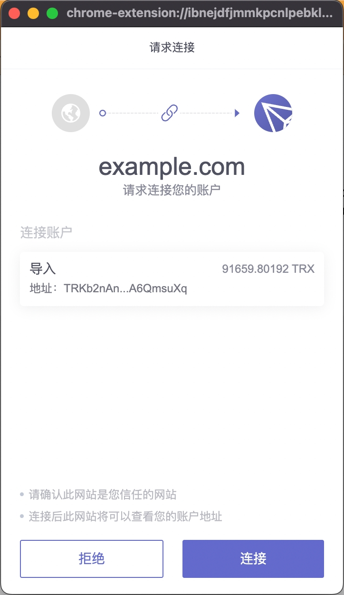
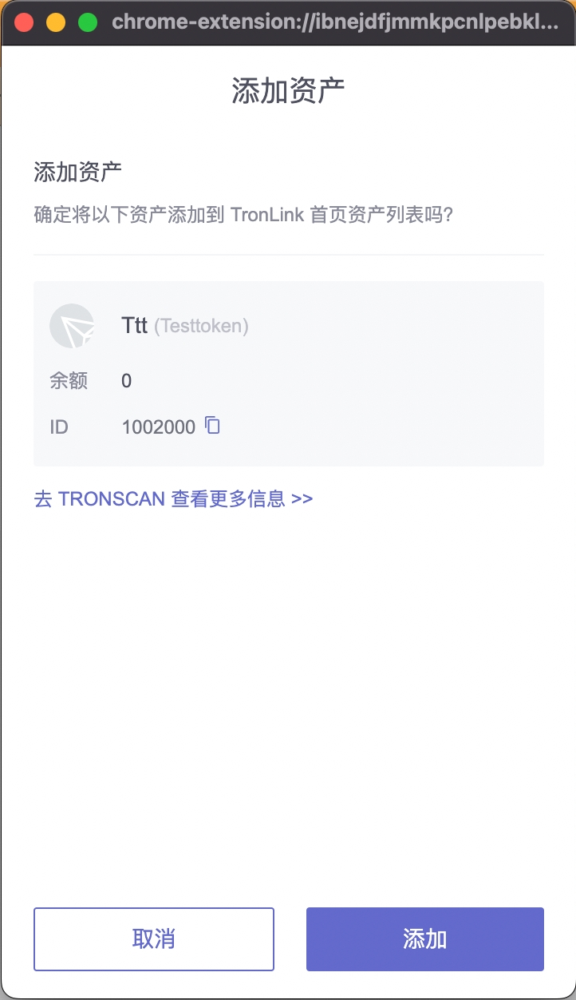
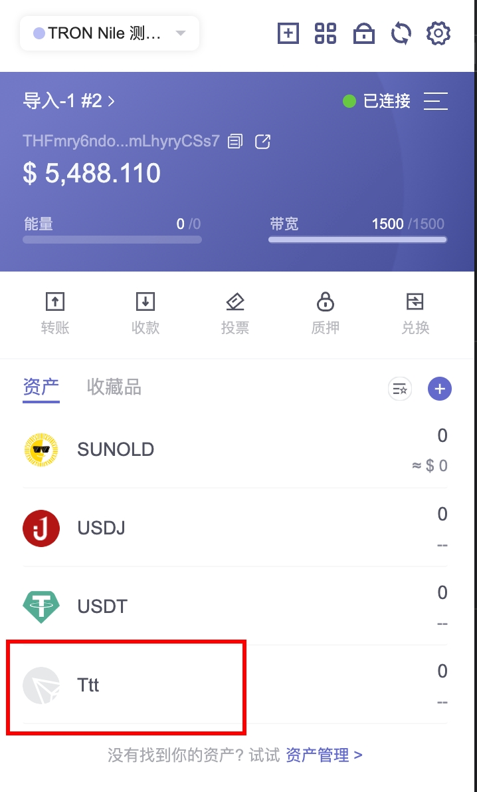
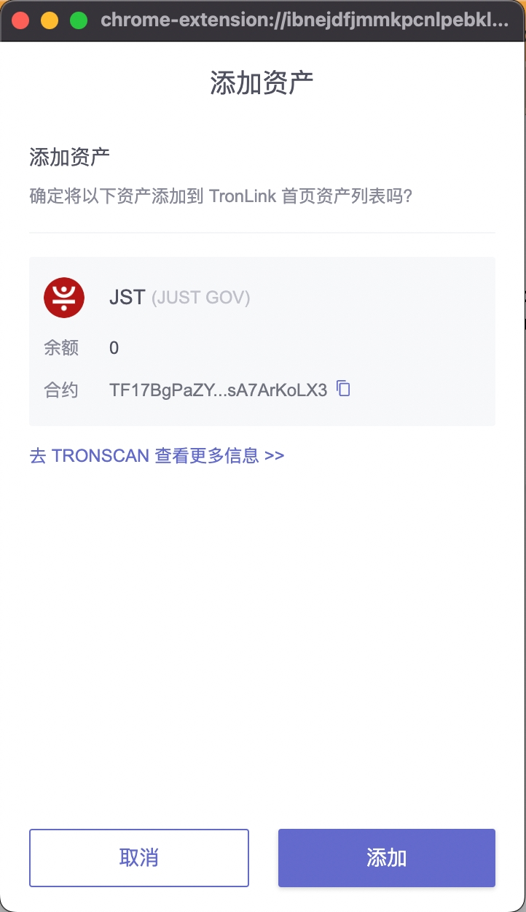
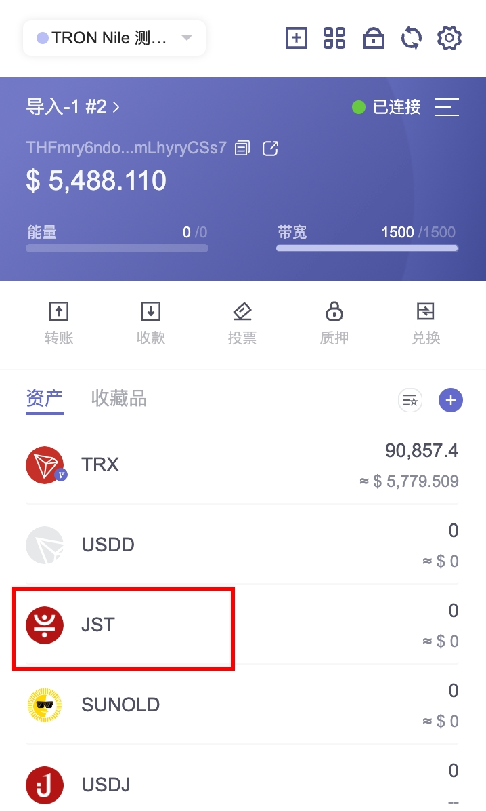
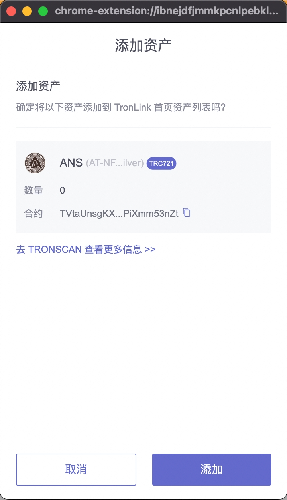

# 主动请求TronLink插件功能

## 连接网站

<span class="deprecated">DEPRECATED</span>

本小节的方法已废弃，预计将在几个版本后移除。TRON 社区正在讨论新的规范，可以到 [TRON-TIP](https://github.com/tronprotocol/tips/issues/463) 参与讨论。


**简介**

TronLink 提供外部发起 TRX 转账，合约签名，授权等功能，基于安全的考虑， 需要用户在关键操作前先对发起请求的 DApp 进行【连接网站】授权，在授权成功后才允许操作。 所以 DApp 要先进行【连接网站】操作，等待用户允许后，方能发起需要授权的请求。

**技术规范**

**代码示例**

```shell

    const res = await tronWeb.request(
      {
        method: 'tron_requestAccounts',
        params: {
          websiteIcon: '',
          websiteName: '',
        },
      }
    );
```
**参数**

```shell

    interface RequestAccountsParams {
      websiteIcon?: string;
      websiteName?: string;
    }
```
  * method: tron_requestAccounts 固定的字符串

  * params: RequestAccountParams类型，具体参数如下：

    * websiteIcon: DApp 网站的图标的网址, 具体会展示在用户已连接网站列表中

    * websiteName: DApp 网站名称

**返回值**

类型说明

```shell

    interface ReqestAccountsResponse {
      code: 200 | 4000 | 4001,
      message: string
    }
```

| 返回码 | 描述 | 返回消息 |
|:-------|:-------|:-------|
| 无  | 钱包处于锁定状态   | 空字符串  |
| 200  | 网站此前已被用户允许连接   | The site is already in the whitelist  |
| 200  | 用户同意连接   | User allowed the request.  |
| 4000  | 当前请求前已经有同一个 DApp 发起了连接网站请求，并且弹窗仍未关闭   | Authorization requests are being processed, please do not resubmit  |
| 4001  | 用户拒绝连接   | User rejected the request  |


**交互流程**

触发`tron_requestAccounts`之后，会打开连接确认的弹窗：




## 添加Token
**简介**

DApp 提供按钮给用户， 直接将指定的 Token 添加到用户插件的资产展示列表中。

**技术规范**

**代码示例**

```shell

    const res = await tronWeb.request({
      method: 'wallet_watchAsset',
      params: {
        type: 'TRC20',
        options: {
            address: 'TR7NHqjeKQxGTCi8q8ZY4pL8otSzgjLj6t'
        }
      },
    });
```
**参数**

```shell

    interface WatchAssetParams {
      type: 'trc10' | 'trc20' | 'trc721';
      options: {
        address: string;
        symbol?: string;
        decimals?: number;
        image?: string;
      }
    }
```
  * method: wallet_watchAsset 固定的字符串

  * params: WatchAssetParams，具体参数如下：

    * type: 目前只支持 'trc10', 'trc20', 'trc721' 三种

    * options:

        * address: token 的合约地址 或者 token id, 必传

        * symbol: 占位(目前未使用)，可选

        * decimals: 占位(目前未使用)，可选

        * image: 占位(目前未使用)，可选

**返回值**

此方法没有返回值

**交互流程**

**添加 TRC10 资产**

```shell

    if (window.tronLink.ready) {
      const tronweb = tronLink.tronWeb;
      try {
        tronweb.request({
          method: 'wallet_watchAsset',
          params: {
            type: 'trc10',
            options: {
              address: '1002000'
            },
          },
        });
      } catch (e) {}
    }
```
代码执行时，TronLink 会弹出添加窗口，用户点击确定添加 TRC10 资产，或者取消添加。



点击“添加”按钮，资产被添加到资产列表，如下图所示：




**添加 TRC20 资产**

```shell

    if (window.tronLink.ready) {
      const tronweb = tronLink.tronWeb;
      try {
        tronweb.request({
          method: 'wallet_watchAsset',
          params: {
            type: 'trc20',
            options: {
              address: 'TF17BgPaZYbz8oxbjhriubPDsA7ArKoLX3'
            },
          },
        });
      } catch (e) {}
    }
```
代码执行时，TronLink 会弹出添加窗口，用户点击确定添加 TRC20 资产，或者取消添加。




点击“添加”按钮，资产被添加到资产列表，如下图所示：




**添加 TRC721 资产**

```shell

    if (window.tronLink.ready) {
      const tronweb = tronLink.tronWeb;
      try {
        tronweb.request({
          method: 'wallet_watchAsset',
          params: {
            type: 'trc721',
            options: {
              address: 'TVtaUnsgKXhTfqSFRnHCsSXzPiXmm53nZt'
            },
          },
        });
      } catch (e) {}
    }
```
代码执行时，TronLink 会弹出添加窗口，用户点击确定添加 TRC721 资产，或者取消添加。




点击”添加”按钮，资产被添加到资产列表，如下图所示：


