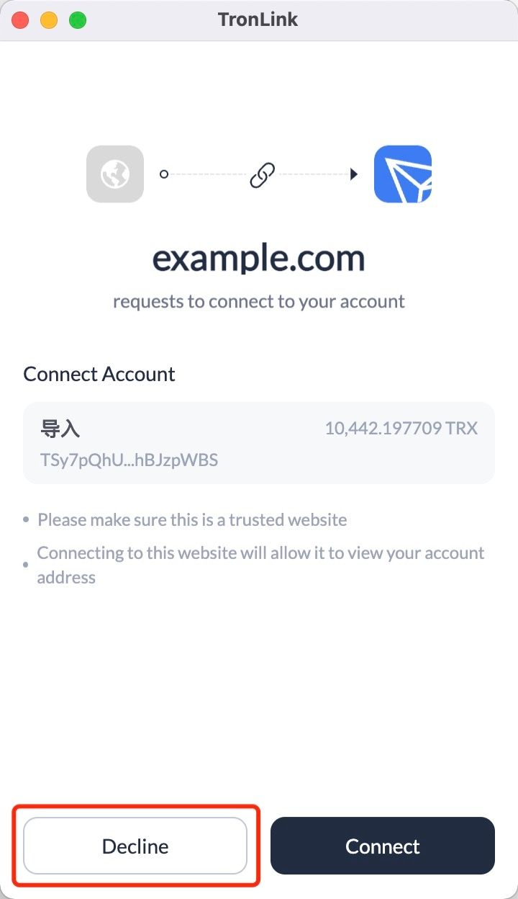
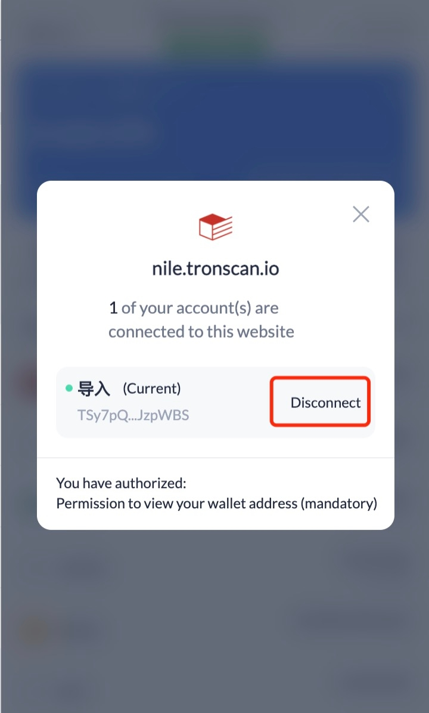
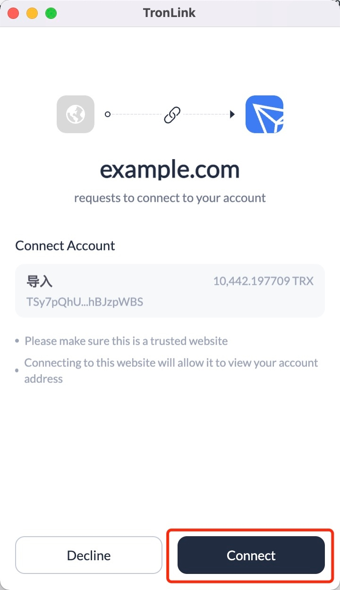
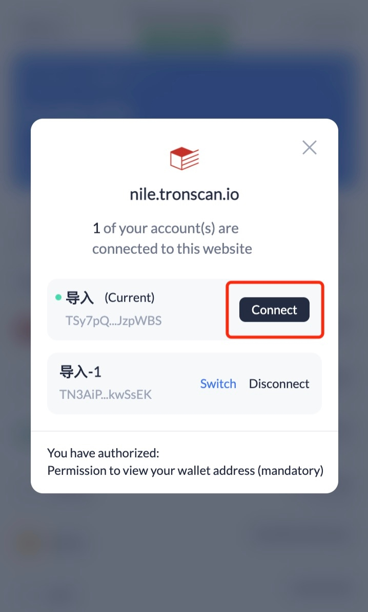

# Receive messages from TronLink

The message is sent using "window.postMessage", and the content received by the Dapp is a MessageEvent.You can refer to <a class="tooltip" href="https://developer.mozilla.org/en-US/docs/Web/API/MessageEvent" data-tooltip="https://developer.mozilla.org/en-US/docs/Web/API/MessageEvent">MDN documentation of MessageEvent</a>.


## Account Change Message

Message ID: `accountsChanged`

**Overview**

This message is generated when:

  1. Users log in

  2. Users switch accounts

  3. Users lock accounts

  4. The wallet is automatically locked after timeout


**Specification**

**Example**

```shell
    
    
    window.addEventListener('message', function (e) {
      if (e.data.message && e.data.message.action === "accountsChanged") {
        // handler logic
        console.log('got accountsChanged event', e.data)
      }
    })
```
**Returns**

```shell
    
    
    interface MessageEventAccountsChangedData {
      isTronLink: boolean;
      message: {
        action: string;
        data: {
          address: string | boolean;
        }
      }
    }
```
**Return value example**

  1. When users log in, the content of the message body is:


```shell
    
    
    {
      "data": {
        "address": "TZ5XixnRyraxJJy996Q1sip85PHWuj4793" // Last selected account address
      }
    }
```
  1. When users switch accounts, the content of the message body is:


```shell
    {
      "data": {
        "address": "TRKb2nAnCBfwxnLxgoKJro6VbyA6QmsuXq" // Newly selected account address
      }
    }
```
  1. When users lock accounts and the wallet is automatically locked due to timeout, the message body content is:


```shell
    {
      "data": {
        "address": false
      }
    }
```


## Network Change Message

Message ID: `setNode`

**Overview**

Developers can monitor this message to know network changes 

This message is generated when:

  1. When the user changes the network


**Specification**

**Example**

```shell
    
    
    window.addEventListener('message', function (e) {
      if (e.data.message && e.data.message.action == "setNode") {
        // handler logic
        console.log('got setNode event', e.data)
      }
    })
```
**Returns**

```shell
    
    
    {
      "node": {
        // Information about the current network
      },
      "connectNode": {
        // Node information of DApp chain
      }
    }
```

## Successful connection message

Message ID: `connect`

**Overview**

Developers can monitor this message for connection changes. 

This message is generated when:

  1. The DApp requests a connection, and the user confirms the connection in the pop-up window

  2. Users connect to the website


**Specification**

**Example**

```shell
    
    
    window.addEventListener('message', function (e) {
      if (e.data.message && e.data.message.action == "connect") {
        // handler logic
        console.log('got connect event', e.data)
      }
    })
```


## Disconnect website message

Message ID: `disconnect`

**Overview**

Developers can monitor this message for connection changes. 

This message is generated when:

  1. The DApp requests a connection, and the user rejects the connection in the pop-up window

  2. Users disconnect from the website


**Specification**

**Example**

```shell
    
    
    window.addEventListener('message', function (e) {
      if (e.data.message && e.data.message.action == "disconnect") {
        // handler logic
        console.log('got connect event', e.data)
      }
    })
```


## Messages to Be Deprecated

  1. The user rejects connection: “rejectWeb”

  2. The user disconnects from the website: “disconnectWeb”

  3. The user accepts connection: “acceptWeb”

  4. The user requests to connect to the website: “connectWeb”


### User rejects connection

<span class="deprecated">DEPRECATED</span>

Message ID: `rejectWeb` 

This message is generated when:

  1. The DApp requests a connection and the user rejects the connection in the pop-up window. 
  
  


Developers can get the connection rejection message by listening to it:

```shell
    
    window.addEventListener('message', function (e) {
      if (e.data.message && e.data.message.action == "rejectWeb") {
        // handler logic
        console.log('got rejectWeb event', e.data)
      }
    })
```


### User disconnects from the website

<span class="deprecated">DEPRECATED</span>

Message ID: `disconnectWeb` 

This message is generated when:

  1. User actively disconnect from the website. 
  
  


Developers can get the disconnection message by listening to it:

```shell
    
    
    window.addEventListener('message', function (e) {
      if (e.data.message && e.data.message.action == "disconnectWeb") {
        // handler logic
        console.log('got disconnectWeb event', e.data)
      }
    })
```


### User accepts connection

<span class="deprecated">DEPRECATED</span>

Message ID: `acceptWeb` 

This message is generated when:

  1. The user accepts connection. 
  
  


Developers can get the connection acceptance message by listening to it:

```shell 
    window.addEventListener('message', function (e) {
      if (e.data.message && e.data.message.action == "acceptWeb") {
        // handler logic
        console.log('got acceptWeb event', e.data)
      }
    })
```


### User requests to connect to the website

<span class="deprecated">DEPRECATED</span>

Message ID: `connectWeb` 

This message is generated when:

  1. The user requests to connect to the website. 
  
  


Developers can get the connection request message by listening to it:

```shell
    window.addEventListener('message', function (e) {
      if (e.data.message && e.data.message.action == "connectWeb") {
        // handler logic
        console.log('got connectWeb event', e.data)
      }
    })
```
