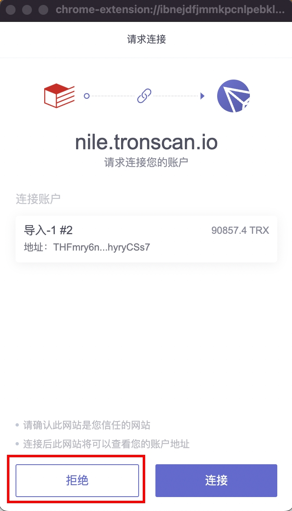
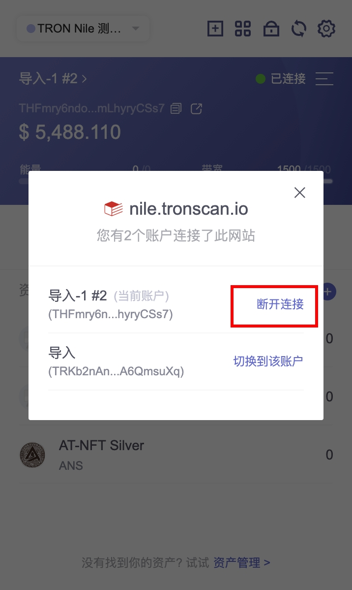
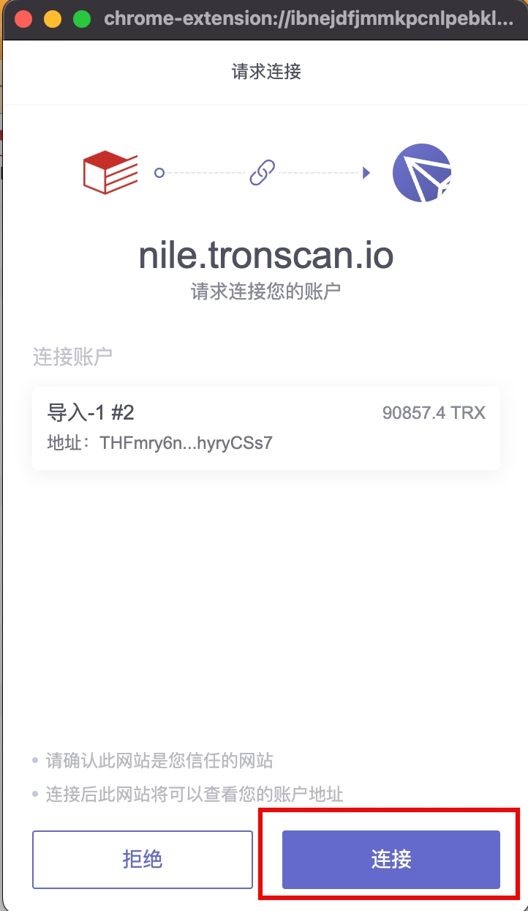
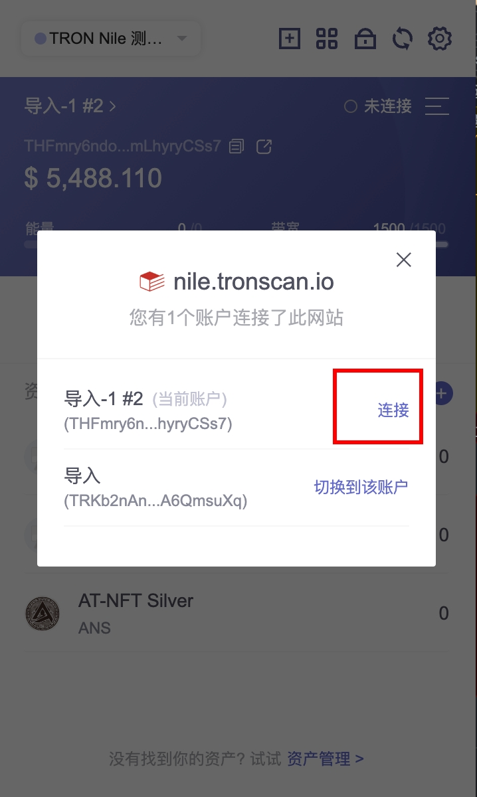

# 被动接收TronLink插件的消息

消息使用 window.postMessage 发送，Dapp 接收到的内容是一个 MessageEvent ，可以参考[<a class="tooltip" href="https://developer.mozilla.org/en-US/docs/Web/API/MessageEvent" data-tooltip="https://developer.mozilla.org/en-US/docs/Web/API/MessageEvent">MessageEvent的MDN文档</a>]。

## 账户改变消息

消息标识： `accountsChanged`

**简介**

以下情况会产生此消息

  1. 用户登陆

  2. 用户切换账号

  3. 用户锁定账号

  4. 钱包超时自动锁定

**技术规范**

**代码示例**

```shell

    window.addEventListener('message', function (e) {
      if (e.data.message && e.data.message.action === "accountsChanged") {
          // handler logic
          console.log('got accountsChanged event', e.data)
      }
    })
```
**返回值**

```shell

    interface MessageEventAccountsChangedData {
      isTronLink: boolean;
      message: {
        action: string;
        data: {
          address: string | boolean;
        }
      }
    }
```
**返回值示例**

  1. 用户登陆时，消息体内容为：

```shell

    {
      "data": {
        "address": "TZ5XixnRyraxJJy996Q1sip85PHWuj4793" // 上次选择的账号地址
      }
    }
```
  1. 用户切换账号时，消息体内容为：

```shell

    {
      "data": {
        "address": "TRKb2nAnCBfwxnLxgoKJro6VbyA6QmsuXq" // 新选择的账号地址
      }
    }
```
  1. 用户锁定和钱包超时自动锁定时，消息体内容为：

```shell

    {
      "data": {
        "address": false
      }
    }
```

## 网络改变消息

消息标识： `setNode`

**简介**

开发者可以监听此消息来获取网络的改变

以下情况会产生此消息

  1. 用户改变网络的时候

**技术规范**

**代码示例**

```shell

    window.addEventListener('message', function (e) {
      if (e.data.message && e.data.message.action == "setNode") {
          // handler logic
          console.log('got setNode event', e.data)
      }
    })
```
**返回值**

```shell

    {
      "node": {
        // 当前网络的信息
      },
      "connectNode": {
        // dapp chain 的节点信息
      }
    }
```

## 连接网站成功消息

消息标识： `connect`

**简介**

开发者可以监听此消息来获取网络的改变。

以下情况会产生此消息：

  1. DApp 请求连接，用户在弹窗中确定连接后

  2. 用户主动连接网站

**技术规范**

**代码示例**

```shell

    window.addEventListener('message', function (e) {
      if (e.data.message && e.data.message.action == "connect") {
          // handler logic
          console.log('got connect event', e.data)
      }
    })
```


## 断开连接网站消息

消息标识： `disconnect`

**简介**

开发者可以监听此消息来获取网络的改变。

以下情况会产生此消息：

  1. DApp 请求连接，用户在弹窗中拒绝连接后

  2. 用户主动断开连接网站

**技术规范**

**代码示例**

```shell

    window.addEventListener('message', function (e) {
      if (e.data.message && e.data.message.action == "disconnect") {
          // handler logic
          console.log('got connect event', e.data)
      }
    })
```


## 即将废弃的消息

以下四个消息在未来4.x版本将会被废弃

  1. 用户拒绝连接消息`rejectWeb`

  2. 用户断连网站消息`disconnectWeb`

  3. 用户确定连接消息`acceptWeb`

  4. 用户主动连接网站消息`connectWeb`

#### 用户拒绝连接消息

<span class="deprecated">DEPRECATED</span>

消息标识： `rejectWeb`

以下情况会产生此消息：

  1. DApp 请求连接，用户在弹窗中拒绝连接后



开发者可以监听此消息来获取用户拒绝连接消息

```shell
    window.addEventListener('message', function (e) {
      if (e.data.message && e.data.message.action == "rejectWeb") {
          // handler logic
          console.log('got rejectWeb event', e.data)
      }
    })
```


### 用户断连网站消息

<span class="deprecated">DEPRECATED</span>

消息标识： `disconnectWeb`

以下情况会产生此消息

  1. 用户主动断接网站



开发者可以监听此消息来获取用户主动断连消息

```shell

    window.addEventListener('message', function (e) {
      if (e.data.message && e.data.message.action == "disconnectWeb") {
          // handler logic
          console.log('got disconnectWeb event', e.data)
      }
    })
```


### 用户确定连接消息

<span class="deprecated">DEPRECATED</span>

消息标识： `acceptWeb`

以下情况会产生此消息

  1. 用户确定连接消息

 

开发者可以监听此消息来获取用户确定连接消息

```shell

    window.addEventListener('message', function (e) {
      if (e.data.message && e.data.message.action == "acceptWeb") {
          // handler logic
          console.log('got acceptWeb event', e.data)
      }
    })
```

### 用户主动连接网站消息

<span class="deprecated">DEPRECATED</span>

消息标识： `connectWeb`

以下情况会产生此消息

  1. 用户确定连接消息



开发者可以监听此消息来获取用户主动连接网站消息

```shell

    window.addEventListener('message', function (e) {
      if (e.data.message && e.data.message.action == "connectWeb") {
          // handler logic
          console.log('got connectWeb event', e.data)
      }
    })
```


